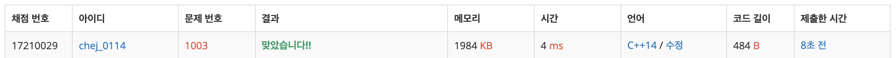

## 문제
- 백준 1003 : 피보나치 함수
- DP
- https://www.acmicpc.net/problem/1003

<br/>

## 풀이
- [1로 만들기](https://github.com/ChoiEunji0114/Algorithm-study/blob/master/posts/boj-1463.md), 
[1,2,3 더하기](https://github.com/ChoiEunji0114/Algorithm-study/blob/master/posts/boj-9095.md) 와 유사한 문제 .. 쉽게 풀었다 🤘
- 각 0과 1에 대해 ``` f(n) = f(n-1) + f(n-2) ``` 을 사용하면 금방 풀 수 있다. (직접 적용해보면 빠르다)

<br/>

## 코드

```c++
#include <iostream>
using namespace std;

int countZero[41];
int countOne[41];

void dp(){
    countZero[0] = 1;
    countOne[1] = 1;
    
    for(int i=2; i<=40; i++){
        countZero[i] = countZero[i-1] + countZero[i-2];
        countOne[i] = countOne[i-1] + countOne[i-2];
    }
}

int main(void){
    
    int t, n;
    cin >> t;
    dp();
    
    for(int i=0; i<t; i++){
        cin >> n;
        cout << countZero[n] << " " << countOne[n] << endl;
    }
    
    return 0;
}
```

<br/>


## screenshot

