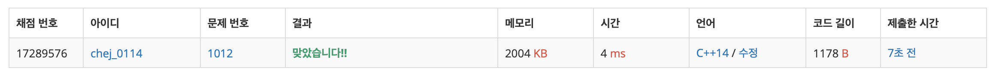

## 문제
- 백준 1012 : 유기농 배추
- DFS
- https://www.acmicpc.net/problem/1012

<br/>

## 풀이
- 전형적인 DFS 문제
- 탐색을 진행하지 않고(```visited = false```) 배추가 있는 경우(```map = 1```) DFS 를 진행했다.


<br/>

## 코드

```c++
#include <iostream>
#include <queue>

using namespace std;

int t, m, n, k, cnt;
int map[51][51] = {0, };
int visited[51][51] = {false, };

const int dx[] = {-1,1,0,0};
const int dy[] = {0,0,-1,1};

queue<pair<int,int>> que;

void dfs(int y, int x){
    visited[y][x] = true;
    for(int i=0; i<4; i++){
        int ny = y + dy[i];
        int nx = x + dx[i];
        if(ny<0 || nx<0 || ny>=n || nx>=m) continue;
        if(visited[ny][nx]) continue;
        if(!visited[ny][nx] && map[ny][nx]==1){
            dfs(ny,nx);
        }
    }
}

void solution(){
    for(int i=0; i<n; i++){
        for(int j=0; j<m; j++){
            if(map[i][j]==1 && !visited[i][j]){
                cnt++;
                dfs(i,j);
            }
        }
    }
    cout << cnt << endl; // 답 출력
    
    // 값 초기화
    cnt=0;
    for(int i=0; i<n; i++){
        for(int j=0; j<m; j++){
            map[i][j] = 0;
            visited[i][j] = false;
        }
    }
}

int main(void){
    cin>>t;
    
    for(int i=0; i<t; i++){
        cin >> m >> n >> k;
        int x, y;
        for(int j=0; j<k; j++){
            cin >> x >> y;
            map[y][x] = 1;
        }
        solution();
    }
    
    return 0;
}
```

<br/>


## screenshot

