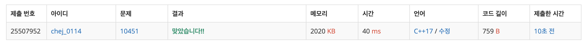

## 문제
- 백준 10451 : 순열 사이클
- https://www.acmicpc.net/problem/10451
- DFS

<br/>

## 풀이
- 간단한 방향 그래프 DFS 문제.
- 비슷한 문제 [2616: 바이러스](https://github.com/choidam/Algorithm-study/blob/master/posts/boj-1616.md), [11724: 연결 요소의 개수]((https://github.com/choidam/Algorithm-study/blob/master/posts/boj-11724.md) 를 참고하면 좋다. 무방향 그래프에서 방향 그래프로 바꿔 풀면 된다.

<br/>

## 코드

```c++
#include <iostream>
#include <cstring>
#define MAX 1001

using namespace std;

int t, n, ans, arr[MAX];
bool visited[MAX];

void dfs(int node){
    visited[node] = true;
    
    int next = arr[node];
    if(!visited[next]) dfs(next);
}

int main(void){
    
    ios::sync_with_stdio(false);
    cin.tie(0); cout.tie(0);
    
    cin >> t;
    
    while(t--){
        memset(visited, false, sizeof(visited));
        memset(arr, 0, sizeof(arr));
        ans = 0;
        
        cin >> n;
        for(int i=1; i<=n; i++){
            cin >> arr[i];
        }
        
        for(int i=1; i<=n; i++){
            if(!visited[i]){
                ans++;
                dfs(i);
            }
        }
        cout << ans << '\n';
    }
    
    return 0;
}

```

<br/>

## screenshot


