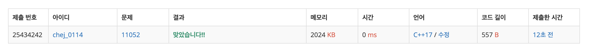

## 문제
- 백준 11052 : 카드 구매하기
- DP
- https://www.acmicpc.net/problem/11052

<br/>

## 풀이
- 간단한 DP문제

<br/>

## 코드

```c++
#include <iostream>
#define MAX 1001

using namespace std;

int n;
int arr[MAX], dp[MAX];

int max(int a, int b){
    return a > b ? a : b;
}

int main(void){
    
    ios::sync_with_stdio(false);
    cin.tie(0); cout.tie(0);
    
    cin >> n;
    for(int i=1; i<=n; i++){
        cin >> arr[i];
    }
    
    dp[1] = arr[1];
    for(int i=2; i<=n; i++){
        int tmp = 0;
        for(int j=1; j<i; j++){
            tmp = max(tmp, dp[i-j]+arr[j]);
        }
        dp[i] = max(tmp, arr[i]);
    }
    
    cout << dp[n] << '\n';
    
    return 0;
}

```

<br/>


## screenshot
