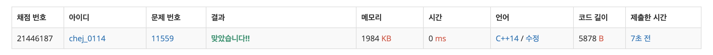

## 문제
- 백준 11559 : puyo puyo
- BFS
- DFS
- https://www.acmicpc.net/problem/11559

<br/>

## 풀이
-

<br/>

## 코드

```c++
#include<iostream>
#include<cstring>
#include<queue>
#include<vector>
 
#define endl "\n"
using namespace std;
 
char MAP[12][6];
bool Visit[12][6];
 
int dx[] = { 0, 0, 1, -1 };
int dy[] = { 1, -1, 0, 0 };
 
int Boom_Cnt = 0;
int Temp_Cnt = 0;
 
vector<pair<int, int>> Boom_Tmp, Boom_Vec;
 
void Input()
{
    for (int i = 0; i < 12; i++)
    {
        for (int j = 0; j < 6; j++)
        {
            cin >> MAP[i][j];
        }
    }
}
 
void DFS(int x, int y)
{
    for (int i = 0; i < 4; i++)
    {
        int nx = x + dx[i];
        int ny = y + dy[i];
 
        if (nx < 0 || ny < 0 || nx >= 12 || ny >= 6) continue;
        if (MAP[nx][ny] == '.') continue;
        if (Visit[nx][ny] == true) continue;
        if (MAP[x][y] != MAP[nx][ny]) continue;
 
        Temp_Cnt++;
        Visit[nx][ny] = true;
        Boom_Tmp.push_back(make_pair(nx, ny));
        DFS(nx, ny);
    }
}
 
void Solution()
{
    bool Flag;
    int Answer = 0;
    while (1)
    {
        Flag = false;
        memset(Visit, false, sizeof(Visit));
        Boom_Vec.clear();
 
        for (int i = 0; i < 12; i++)
        {
            for (int j = 0; j < 6; j++)
            {
                if (MAP[i][j] != '.' && Visit[i][j] == false)
                {
                    Temp_Cnt = 1;
                    Boom_Tmp.push_back(make_pair(i, j));
                    Visit[i][j] = true;
                    DFS(i, j);
 
                    if (Temp_Cnt >= 4)
                    {
                        Flag = true;    // 뿌요가 터졌다고 표시.
                        for (int i = 0; i < Boom_Tmp.size(); i++)
                        {
                            Boom_Vec.push_back(Boom_Tmp[i]);    // 해당 좌표들 옮겨주기
                        }
                    }
                    Boom_Tmp.clear();
                }
            }
        }
 
        for (int i = 0; i < Boom_Vec.size(); i++)
        {
            int x = Boom_Vec[i].first;
            int y = Boom_Vec[i].second;
 
            MAP[x][y] = '.';
        }
 
        for (int i = 10; i >= 0; i--)
        {
            for (int j = 0; j < 6; j++)
            {
                if (MAP[i][j] == '.') continue;
                int Tmp = i;
 
                while (1)
                {
                    if (Tmp == 11 || MAP[Tmp + 1][j] != '.') break;
 
                    MAP[Tmp + 1][j] = MAP[Tmp][j];
                    MAP[Tmp][j] = '.';
                    Tmp++;
                }
            }
        }
        if (Flag == true) Answer++;
        else break;
    }
    cout << Answer << endl;
}
 
void Solve()
{
    Input();
    Solution();
}
 
int main(void)
{
    ios::sync_with_stdio(false);
    cin.tie(NULL);
    cout.tie(NULL);
    Solve();
 
    return 0;
}
```

<br/>

## screenshot

