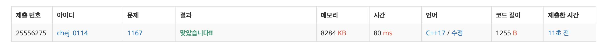

## 문제
- 백준 1167 : 카드 구매하기
- DFS
- https://www.acmicpc.net/problem/1167

<br/>

## 풀이
트리의 가장 긴 지름을 구하기 위해선 두 가지 단계가 필요하다.

1. 루트 노드에서 가장 멀리 있는 (거리 가중치가 가장 큰) 노드를 선택한다.
2. 그 노드를 기준으로 가장 먼 것을 선택한다. 이 때 누적된 거리 합이 정답이다.

<br/>

## 코드

```c++
#include <iostream>
#include <cstring>
#include <vector>
#define MAX 100001

using namespace std;

int v;
vector<pair<int, int>> graph[MAX];
bool visited[MAX];
int diameter, farthest_node; // 지름, 루트에서 가장 먼 노드

int max(int a, int b){
    return a > b ? a : b;
}

void dfs(int node, int cost){
    if(visited[node]) return;
    visited[node] = true;
    
    // 지름 업데이트
    if(diameter < cost) {
        diameter = cost;
        farthest_node = node;
    }
    
    for(int i=0; i<graph[node].size(); i++){
        dfs(graph[node][i].first, cost + graph[node][i].second);
    }
}

int main(void){
    
    ios::sync_with_stdio(false);
    cin.tie(0); cout.tie(0);
    
    cin >> v;
    while(v--){
        int node;
        cin >> node;
        while(true){
            int node2, cost;
            cin >> node2;
            if(node2 == -1) break;
            cin >> cost;
            
            graph[node].push_back(make_pair(node2, cost));
        }
    }
    
    // 루트에서 가장 먼 정점 찾기
    memset(visited, false, sizeof(visited));
    dfs(1, 0);
    
    // 가장 먼 정점에서 탐색 시작
    memset(visited, false, sizeof(visited));
    diameter = 0; // 초기화
    dfs(farthest_node, 0);
    
    cout << diameter << '\n';
    
    return 0;
}

```

<br/>


## screenshot
