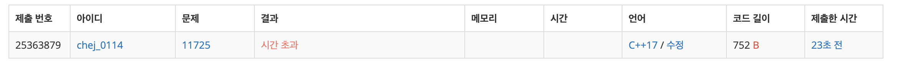
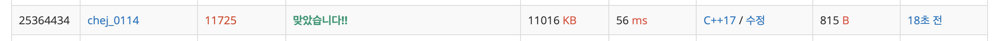

## 문제
- 백준 11725 : 트리의 부모 찾기
- https://www.acmicpc.net/problem/11725
- 그래프
- DFS / BFS

<br/>

## 풀이
- 그래프를 차분히 풀어보면 알 수 있는 문제 (비슷한 문제 [참고](https://github.com/choidam/Algorithm-study/blob/master/posts/boj-11724.md))
- 처음엔 각 노드의 부모를 정확히 알 수 없으므로 무방향 그래프로 접근한 다음 방문 표시를 통해 부모 노드를 구분했다.
- 트리의 루트가 1이므로 1부터 DFS 탐색을 시작한다.


<br/>

## 코드
```c++
#include <iostream>
#include <vector>
#define MAX 100000

using namespace std;

int n;
vector<int> graph[MAX];
int ans[MAX]; // 트리의 부모 저장
bool visited[MAX];

void dfs(int node){
    visited[node] = true;
    
    for(int i=0; i<graph[node].size(); i++){
        int next = graph[node][i];
        if(!visited[next]){
            ans[next] = node;
            dfs(next);
        }
    }
}

int main(void){
    
    cin >> n;
    for(int i=1; i<n; i++){
        int node1, node2;
        cin >> node1 >> node2;
        
        // 무방향 그래프
        graph[node1].push_back(node2);
        graph[node2].push_back(node1);
    }
    
    dfs(1);
    for(int i=2; i<=n; i++){
        cout << ans[i] << endl;
    }
    
    return 0;
}

```



간단한 탐색 문제네!! 하고 풀었더니 .. 시간 초과 에러가 났다.

딱히 에러도 없고 푸는 방법도 탐색이 맞는 것 같아 출력 방법에서의 문제일 것 같았다. (참고: [출력 속도 비교](https://www.acmicpc.net/blog/view/57))

```c++
ios_base::sync_with_stdio(false);
cout.tie(NULL);
```

그리고 MAX 범위를 수정했다.

```c++
#define MAX 100001 // 100000 -> 100001
```


## 최종 풀이

```c++
#include <iostream>
#include <vector>
#define MAX 100001

using namespace std;

int n;
vector<int> graph[MAX];
int ans[MAX]; // 트리의 부모 저장
bool visited[MAX];

void dfs(int node){
    visited[node] = true;
    
    for(int i=0; i<graph[node].size(); i++){
        int next = graph[node][i];
        if(!visited[next]){
            ans[next] = node;
            dfs(next);
        }
    }
}

int main(void){
    
    ios_base::sync_with_stdio(false);
    cout.tie(NULL);
    
    cin >> n;
    for(int i=1; i<n; i++){
        int node1, node2;
        cin >> node1 >> node2;
        
        // 무방향 그래프
        graph[node1].push_back(node2);
        graph[node2].push_back(node1);
    }
    
    dfs(1);
    for(int i=2; i<=n; i++){
        cout << ans[i] << '\n';
    }
    
    return 0;
}

```




입출력 시간 문제, 인덱스 범위에 유의하자!