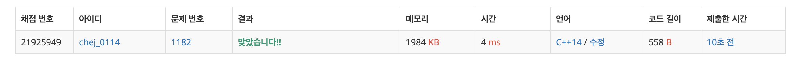

## 문제
- 백준 1182 : 부분 수열의 합
- 부르트포스
- 백트래킹
- https://www.acmicpc.net/problem/1182

<br/>

## 풀이
- 간단한 **조합** 알고리즘이다. 

  ```c++
  		comb(idx+1, sum-arr[idx]); // 해당 숫자를 안 더했을 경우
      comb(idx+1, sum); // 해당 숫자를 더했을 경우
  ```

  이 부분이 핵심이다. 해당 숫자를 더했을 경우, 안 더했을 경우를 나눠서 재귀호출을 해야 한다.    

  그리고 적절히 문제 조건에 맞추어 종료시킨다. 

<br/>

## 코드

```c++
#include <iostream>
#define MAX 20
using namespace std;

int n, s;
int arr[MAX];
int result = 0;

// idx : 선택한 숫자의 인덱스, sum: 합
void comb(int idx, int sum){
    
    sum += arr[idx];
    
    if(idx>=n) return;
    
    if(sum==s) result++;
    
    comb(idx+1, sum-arr[idx]); // 해당 숫자를 안 더했을 경우
    comb(idx+1, sum); // 해당 숫자를 더했을 경우
}


int main(void){
    
    cin >> n >> s;
    
    for(int i=0; i<n; i++){
        cin >> arr[i];
    }
    
    comb(0, 0);
    
    cout << result << endl;
}
```
<br/>


## screenshot



