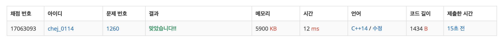

## 문제
- 백준 1260 : DFS 와 BFS
- DFS / BFS
- https://www.acmicpc.net/problem/1260

<br/>

## 풀이
- 오랜만에 풀어보는 탐색 문제라 그런가 쉬운 문제인데도 시간이 꽤 걸렸다.
- 기본적인 DFS / BFS 문제

<br/>

## 코드

```c++
#include <iostream>
#include <queue>
#include <cstring>

using namespace std;

const int MAX = 1000+1;

int n, m, v; // 정점의 개수, 간선의 개수, 탐색 시작 번호
int map[MAX][MAX];
bool visited[MAX];
queue<int> que;

void dfs(int idx){
    cout << idx << " "; // 탐색한 정점 출력
    for(int i=1; i<=n; i++){
        if(map[idx][i] && !visited[i]){ // 아직 방문하지 않은 인접한 노드인 경우
            visited[i] = 1; // 방문 표시
            dfs(i); // 재귀 호출
        }
    }
}

void bfs(int idx){
    que.push(idx);
    visited[idx] = 1;
    
    while(!que.empty()){
        idx = que.front();
        que.pop();
        
        cout << idx << " "; // 탐색한 정점 출력
        
        for(int i=1; i<=n; i++){
            if(map[idx][i] && !visited[i]){
                visited[i] = 1;
                que.push(i);
            }
        }
    }
}


int main(void){
    
    cin >> n >> m >> v;
    
    for(int i=0; i<m; i++){
        int from, to;
        cin >> from >> to;
        map[from][to] = 1;
        map[to][from] = 1;
    }
    
    visited[v] = 1; // v에서 탐색 시작
    dfs(v);
    cout << endl;
    
    memset(visited, false, sizeof(visited)); // 방문 초기화
    bfs(v);
    cout << endl;
    
    return 0;
}

```

<br/>


## screenshot

