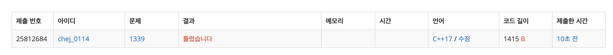

## 문제
- 백준 1339 : 단어 수학
- 부르트포스
- https://www.acmicpc.net/problem/1339

<br/>

## 풀이1
```c++
#include <iostream>
#include <vector>
#include <algorithm>
#include <string>

using namespace std;

int word2ascii(vector<int> &ascii, vector<string> &words, vector<char> &alphabet){
    int sum = 0;
    char alpha[256];
    for(int i=0; i<alphabet.size(); i++){
        alpha[alphabet[i]] = ascii[i];
    }
    
    for(int i=0; i<words.size(); i++){
        int tmpsum = 0;
        for(int j=0; j<words[i].length(); j++){
            tmpsum = tmpsum*10 + alpha[words[i][j]];
        }
        sum += tmpsum;
    }
    
    return sum;
}

int max(int a, int b){
    return a > b ? a : b;
}

int main(void){

    ios::sync_with_stdio(false);
    cin.tie(0); cout.tie(0);
    
    int n;
    cin >> n;
    
    vector<string> words(n); vector<char> alphabet;
    for(int i=0; i<n; i++){
        cin >> words[i];
        for(int j=0; j<words[i].length(); j++){
            alphabet.push_back(words[i][j]);
        }
    }
    
    // 알파벳 중복 제거
    sort(alphabet.begin(), alphabet.end());
    alphabet.erase(unique(alphabet.begin(), alphabet.end()), alphabet.end());
    
    vector<int> ascii(alphabet.size());
    for(int i=0; i<ascii.size(); i++){
        ascii[i] = 9-i;
    }
    
    int ans = 0;
    do{
        int tmp = word2ascii(ascii, words, alphabet);
        ans = max(ans, tmp);
    } while(next_permutation(ascii.begin(), ascii.end()));
    
    cout << ans << '\n';
    
    return 0;
}
```



입력받은 단어의 알파벳을 모두 `vector alphabet<char>` 에 넣은 후 중복 제거를 한 다음, 9부터 숫자를 하나씩 줄여 나가 `vector ascii<int>` 에 alphabet 크기 만큼 넣어서, 이를 `next_permutation` 조합을 사용해 숫자를 대입해 계산했다.

그러나 결과는 실패..! 백준 두번째 예시도 제대로 돌아가지 않았다.

<br/>

## 풀이2

풀이의 문제점을 찾았다. `next_permutation` 함수는 **다음 순열** 을 구하는 함수라는 것이 문제이다.

```c++
vector<int> ascii(alphabet.size());
for(int i=0; i<ascii.size(); i++){
    ascii[i] = 9-i;
}
```

위 `ascii` 벡터에는 원소가 내림차순으로 정렬되어 들어가있어서 ( {9,8,7,6, ...} )  다음 순열이 존재하지 않아 종료된다. 그러므로 **오름차순** 으로 정렬하는 것이 필요하다.

```c++
sort(ascii.begin(), ascii.end());
```

`ascii` 벡터에 원소를 넣은 다음 위 코드를 추가해 오름차순으로 정렬했다. 그리고 지저분한 코드 몇 가지를 수정했다.

아래는 최종 코드이다.

<br/>

```c++
#include <iostream>
#include <vector>
#include <algorithm>
#include <string>

using namespace std;

char alpha[256]; // alpha[i] : 아스키 코드로 i의 값

int calculate(vector<string> &words, vector<char> &alphabet, vector<int> &ascii){
    int sum = 0;
    int m = alphabet.size();
    // 아스키코드 값
    for(int i=0; i<m; i++){
        alpha[alphabet[i]] = ascii[i];
    }
    
    // 단어 계산
    for(string s: words){
        int tmp = 0;
        for (char ch: s){
            tmp = tmp*10 + alpha[ch];
        }
        sum += tmp;
    }
    
    return sum;
}

int max(int a, int b){
    return a > b ? a : b;
}

int main(void){

    ios::sync_with_stdio(false);
    cin.tie(0); cout.tie(0);
    
    int n;
    cin >> n;
    
    vector<string> words(n); // 단어
    vector<char> alphabet; // 알파벳
    
    for(int i=0; i<n; i++){
        cin >> words[i];
        for(char ch: words[i]){
            alphabet.push_back(ch);
        }
    }
    
    // 알파벳 중복 제거
    sort(alphabet.begin(), alphabet.end());
    alphabet.erase(unique(alphabet.begin(), alphabet.end()), alphabet.end());
    
    vector<int> ascii;
    int m = alphabet.size();
    for(int i=9; i>9-m; i--){
        ascii.push_back(i);
    }
    sort(ascii.begin(), ascii.end()); // next_permutation 쓰기 위함
    int ans = 0;
    
    // 알파벳 숫자 조합
    do{
        int tmp = calculate(words, alphabet, ascii);
        if(ans < tmp){
            ans = tmp;
        }
    } while(next_permutation(ascii.begin(), ascii.end()));
    
    cout << ans << '\n';
    
    return 0;
}

```


