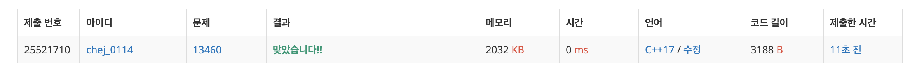

## 문제
- 백준 13460 : 구슬 탈출 2
- BFS
- https://www.acmicpc.net/problem/13460

<br/>

## 풀이
- 너무 어려웠던 문제 .. 풀이도 정말 한참 읽었다. ㅠㅠ
- 빨간 구슬과 파란 구슬의 이동 좌표는 모두 `queue` 에 저장합니다.

```c++
queue <pair<pair<int, int>, pair<int, int>>> que;
```

- 빨간 구슬과 파란 구슬은 기존 탐색처럼 한 칸씩 이동하는 것이 아닌, `#` (벽) 또는 `0` (구멍, 도착지) 가 나올때까지 while 문을 돌며 이동합니다. 

```c++
// 빨간 구슬 이동
while (arr[red_nx + dx[i]][red_ny + dy[i]] != '#' && arr[red_nx][red_ny] != 'O') {
  red_nx += dx[i];
  red_ny += dy[i];
}
// 파란 구슬 이동
while (arr[blue_nx + dx[i]][blue_ny + dy[i]] != '#' && arr[blue_nx][blue_ny] != 'O') {
  blue_nx += dx[i];
  blue_ny += dy[i];
}
```

- 빨간 구슬과 파란 구슬이 만나는 경우, 더 많이 이동한 구슬을 한 칸 뒤로 이동시킵니다.

```c++
if (abs(red_nx - redball_x) + abs(red_ny - redball_y) < abs(blue_nx - blueball_x) + abs(blue_ny - blueball_y)) {
  blue_nx -= dx[i];
  blue_ny -= dy[i];
} else {
  red_nx -= dx[i];
  red_ny -= dy[i];
}
```

<br/>

## 코드

```c++
#include <iostream>
#include <queue>

using namespace std;

#define MAX 11

int N, M;
char arr[MAX][MAX];
bool visit[MAX][MAX][MAX][MAX];

const int dx[4] = { 0, 0, -1, 1 };
const int dy[4] = { 1, -1, 0 ,0 };

int red_x, red_y, blue_x, blue_y;

int abs(int num){
    if(num>0) return num;
    else return num*(-1);
}

int BFS() {
    queue <pair<pair<int, int>, pair<int, int>>> que;
    que.push(make_pair(make_pair(red_x, red_y), make_pair(blue_x, blue_y)));
    visit[red_x][red_y][blue_x][blue_y] = true;
    int result = 0;

    while (!que.empty()) {
        int size = que.size();
        while (size--) {
            int redball_x = que.front().first.first;
            int redball_y = que.front().first.second;
            int blueball_x = que.front().second.first;
            int blueball_y = que.front().second.second;
            que.pop();
            
            // 도착한 경우
            if (arr[redball_x][redball_y] == 'O' && arr[redball_x][redball_y] != arr[blueball_x][blueball_y]) {
                return result;
            }

            // 구슬 탐색 시작
            for (int i = 0; i < 4; i++) {
                int red_nx = redball_x;
                int red_ny = redball_y;
                int blue_nx = blueball_x;
                int blue_ny = blueball_y;
                
                // 빨간 구슬 이동
                while (arr[red_nx + dx[i]][red_ny + dy[i]] != '#' && arr[red_nx][red_ny] != 'O') {
                    red_nx += dx[i];
                    red_ny += dy[i];
                }
                
                // 파란 구슬 이동
                while (arr[blue_nx + dx[i]][blue_ny + dy[i]] != '#' && arr[blue_nx][blue_ny] != 'O') {
                    blue_nx += dx[i];
                    blue_ny += dy[i];
                }
                
                // 빨간 구슬과 파란 구슬의 위치가 같은 경우
                if (red_nx == blue_nx && red_ny == blue_ny) {
                    if (arr[red_nx][blue_ny] == 'O') continue;
                    
                    // 이동거리가 많은 구슬을 한 칸 뒤로 이동시킴
                    if (abs(red_nx - redball_x) + abs(red_ny - redball_y) < abs(blue_nx - blueball_x) + abs(blue_ny - blueball_y)) {
                        blue_nx -= dx[i];
                        blue_ny -= dy[i];
                    }
                    else {
                        red_nx -= dx[i];
                        red_ny -= dy[i];
                    }
                }
                
                if (visit[red_nx][red_ny][blue_nx][blue_ny]) continue;
                que.push(make_pair(make_pair(red_nx, red_ny), make_pair(blue_nx, blue_ny)));
                visit[red_nx][red_ny][blue_nx][blue_ny] = true;
            }
        }
        if (result >= 10) return -1;
        result++;
    }
    return -1;
}

int main() {
    ios::sync_with_stdio(false);
    cin.tie(0); cout.tie(0);
    cin >> N >> M;

    for (int i = 0; i < N; i++) {
        for (int j = 0; j < M; j++) {
            cin >> arr[i][j];
            if (arr[i][j] == 'R') {
                red_x = i; red_y = j;
            } else if (arr[i][j] == 'B') {
                blue_x = i; blue_y = j;
            }
        }
    }
    cout << BFS() << '\n';
    
    return 0;
}

```

<br/>

```c++
#include <iostream>
#include <vector>
#include <string>
using namespace std;
int dx[] = {0,0,1,-1};
int dy[] = {1,-1,0,0};
const int LIMIT = 10;
vector<int> gen(int k) {
    vector<int> a(LIMIT);
    for (int i=0; i<LIMIT; i++) {
        a[i] = (k&3);
        k >>= 2;
    }
    return a;
}
pair<bool,bool> simulate(vector<string> &a, int k, int &x, int &y) {
    if (a[x][y] == '.') return make_pair(false, false);
    int n = a.size();
    int m = a[0].size();
    bool moved = false;
    while (true) {
        int nx = x+dx[k];
        int ny = y+dy[k];
        if (nx < 0 || nx >= n || ny < 0 || ny >= m) {
            return make_pair(moved, false);
        }
        if (a[nx][ny] == '#') {
            return make_pair(moved, false);
        } else if (a[nx][ny] == 'R' || a[nx][ny] == 'B') {
            return make_pair(moved, false);
        } else if (a[nx][ny] == '.') {
            swap(a[nx][ny], a[x][y]);
            x = nx;
            y = ny;
            moved = true;
        } else if (a[nx][ny] == 'O') {
            a[x][y] = '.';
            moved = true;
            return make_pair(moved, true);
        }
    }
    return make_pair(false, false);
}
int check(vector<string> a, vector<int> &dir) {
    int n = a.size();
    int m = a[0].size();
    int hx,hy,rx,ry,bx,by;
    for (int i=0; i<n; i++) {
        for (int j=0; j<m; j++) {
            if (a[i][j] == 'O') {
                hx = i; hy = j;
            } else if (a[i][j] == 'R') {
                rx = i; ry = j;
            } else if (a[i][j] == 'B') {
                bx = i; by = j;
            }
        }
    }
    int cnt = 0;
    for (int k : dir) {
        cnt += 1;
        bool hole1=false, hole2=false;
        while (true) {
            auto p1 = simulate(a, k, rx, ry);
            auto p2 = simulate(a, k, bx, by);
            if (p1.first == false && p2.first == false) {
                break;
            }
            if (p1.second) hole1 = true;
            if (p2.second) hole2 = true;
        }
        if (hole2) return -1;
        if (hole1) return cnt;
    }        
    return -1;
}
bool valid(vector<int> &dir) {
    int l = dir.size();
    for (int i=0; i+1<l; i++) {
        if (dir[i] == 0 && dir[i+1] == 1) return false;
        if (dir[i] == 1 && dir[i+1] == 0) return false;
        if (dir[i] == 2 && dir[i+1] == 3) return false;
        if (dir[i] == 3 && dir[i+1] == 2) return false;
        if (dir[i] == dir[i+1]) return false;
    }
    return true;
}
int main() {
    int n, m;
    cin >> n >> m;
    vector<string> a(n);
    for (int i=0; i<n; i++) {
        cin >> a[i];
    }
    int ans = -1;
    for (int k=0; k<(1<<(LIMIT*2)); k++) {
        vector<int> dir = gen(k);
        if (!valid(dir)) continue;
        int cur = check(a, dir);
        if (cur == -1) continue;
        if (ans == -1 || ans > cur) ans = cur;
    }
    cout << ans << '\n';
    return 0;
}
```

<br/>

## screenshot

