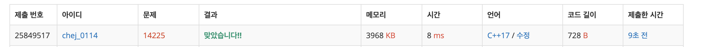

## 문제
- 백준 14225 : 부분 수열의 합
- https://www.acmicpc.net/problem/14225
- 그리디

<br/>

## 풀이
- 그리디 재귀 함수로 구현하는 기본적인 문제
- [백준 6603: 로또](https://github.com/choidam/Algorithm-study/blob/master/posts/boj-6603.md) , [백준 1182: 부분수열의 합](https://github.com/choidam/Algorithm-study/blob/master/posts/boj-1182.md) 와 매우 비슷한 문제이다.

<br/>

## 풀이1 (재귀함수 호출)

```c++
#include <iostream>
#define MAX 2000000

using namespace std;

int n, arr[20];
bool c[MAX];

void go(int index, int sum){
    if(index == n) { // n개 모두 선택했을 경우
        c[sum] = true;
        return;
    }
    
    go(index+1, sum+arr[index]); // index번째를 선택했을 경우
    go(index+1, sum); // index번째를 선택하지 않았을 경우
}

int main(void){
    
    ios::sync_with_stdio(false);
    cin.tie(0); cout.tie(0);
    
    cin >> n;
    
    for(int i=0; i<n; i++){
        cin >> arr[i];
    }
    
    go(0,0);
    int goal = 0;
    
    while(true){
        goal++;
        if(c[goal]==false){
            cout << goal << '\n';
            break;
        }
    }
    
    return 0;
}

```

<br/>

## 풀이2 (비트마스크 활용)

```c++
#include <iostream>
#define MAX 20*100000

using namespace std;

int n;
int arr[21];
bool check[MAX];

int main(void){
    
    ios::sync_with_stdio(false);
    cin.tie(0); cout.tie(0);
    
    cin >> n;
    for(int i=0; i<n; i++){
        cin >> arr[i];
    }
    
    for(int i=0; i<(1<<n); i++){ // 모든 부분 수열 만들기
        int sum = 0;
        for(int j=0; j<n; j++){
            if(i&(1<<j)){
                sum += arr[j];
            }
        }
        check[sum] = true;
    }
    
    for(int i=1; ; i++){
        if(check[i]==false){
            cout << i << '\n';
            break;
        }
    }
    
    return 0;
}

```

<br/>

## screenshot


