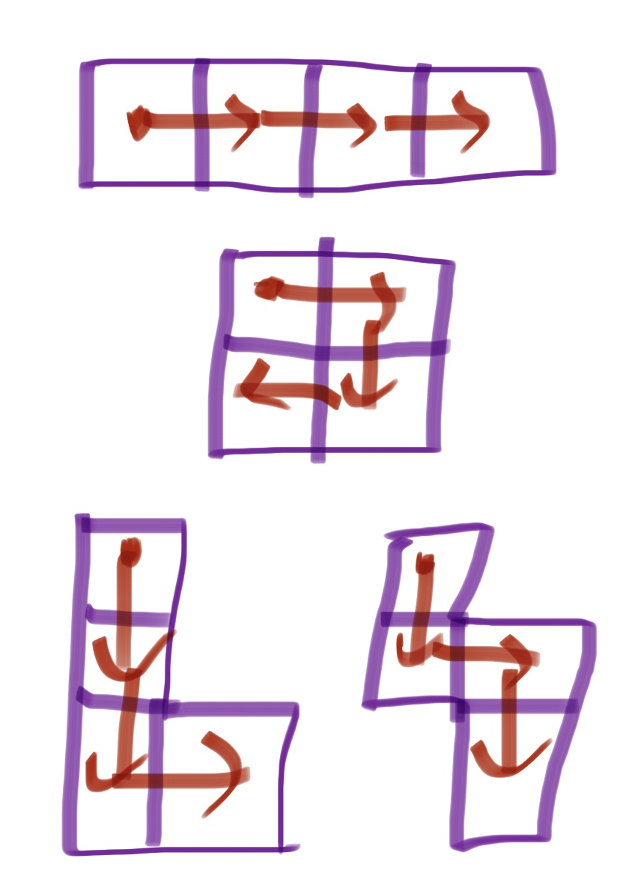
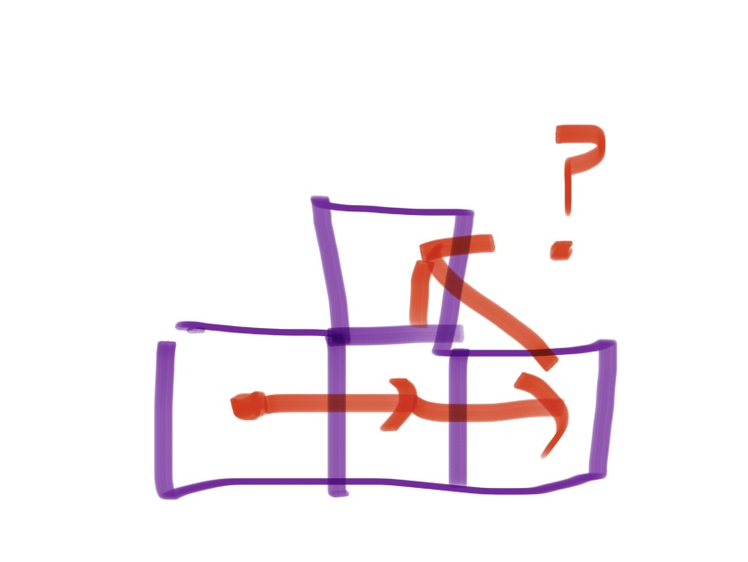
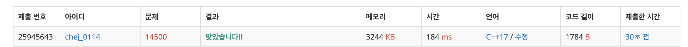

## 문제

- 백준 14500 : 테트로미노
- 부르트포스
- https://www.acmicpc.net/problem/14500

<br/>

## 풀이
<div align="center"></div>

왼쪽 네 가지 경우는 임의의 한 칸에서 시작해 3칸을 연속으로 방문한 경우지만, 오른쪽의 경우는 재귀 함수로 풀기 불가능하다. 따라서 예외 처리를 해야 한다.


```c++
void solve(int y, int x, int sum, int cnt){
    if(cnt==4){ // 테트로미노 완성 (4개 탐색 완료) -> 종료
        ans = max(ans, sum);
        return;
    }
    
    // 범위 넘어가는 경우 -> 종료
    if(y<0 || x<0 || y>=n || x>=m) return;
    
    // 이미 방문한 경우 -> 종료
    if(visited[y][x]) return;
    
    // 탐색 시작
    visited[y][x] = true;
    for(int i=0; i<4; i++){
        solve(y+dy[i], x+dx[i], sum+map[y][x], cnt+1);
    }
    visited[y][x] = false;
    
}
```

재귀의 경우 위와 같이 처리하고,

```c++
   for(int i=0; i<n; i++){
        for(int j=0; j<m; j++){
            // 예외 처리
            if(j+2<m){
                int tmp = map[i][j] + map[i][j+1] + map[i][j+2];
                if(i-1 >= 0){
                    ans = max(ans, tmp+map[i-1][j+1]);
                }
                if(i+1 < n){
                    ans = max(ans, tmp+map[i+1][j+1]);
                }
            }
            if(i+2<n){
                int tmp = map[i][j] + map[i+1][j] + map[i+2][j];
                if(j-1 >= 0){
                    ans = max(ans, tmp+map[i+1][j-1]);
                }
                if(j+1 < m){
                    ans = max(ans, tmp+map[i+1][j+1]);
                }
            }
        }
    }
```

예외 처리는 for문을 돌며 각각 범위를 체크하며 답과 비교한다.

<br/>

## 코드

```c++
#include <iostream>
#define MAX 501

using namespace std;

const int dy[4] = {-1,1,0,0};
const int dx[4] = {0,0,-1,1};

int n, m, map[MAX][MAX];
bool visited[MAX][MAX];
int ans = 0;

int max(int a, int b){
    return a > b ? a : b;
}

void solve(int y, int x, int sum, int cnt){
    if(cnt==4){ // 테트로미노 완성 (4개 탐색 완료) -> 종료
        ans = max(ans, sum);
        return;
    }
    
    // 범위 넘어가는 경우 -> 종료
    if(y<0 || x<0 || y>=n || x>=m) return;
    
    // 이미 방문한 경우 -> 종료
    if(visited[y][x]) return;
    
    // 탐색 시작
    visited[y][x] = true;
    for(int i=0; i<4; i++){
        solve(y+dy[i], x+dx[i], sum+map[y][x], cnt+1);
    }
    visited[y][x] = false;
    
}

int main(void){
    
    ios::sync_with_stdio(false);
    cin.tie(0); cout.tie(0);
    
    cin >> n >> m;
    
    for(int i=0; i<n; i++){
        for(int j=0; j<m; j++){
            cin >> map[i][j];
        }
    }
    
    for(int i=0; i<n; i++){
        for(int j=0; j<m; j++){
            solve(i, j, 0, 0);
            
            // 예외 처리
            if(j+2<m){
                int tmp = map[i][j] + map[i][j+1] + map[i][j+2];
                if(i-1 >= 0){
                    ans = max(ans, tmp+map[i-1][j+1]);
                }
                if(i+1 < n){
                    ans = max(ans, tmp+map[i+1][j+1]);
                }
            }
            if(i+2<n){
                int tmp = map[i][j] + map[i+1][j] + map[i+2][j];
                if(j-1 >= 0){
                    ans = max(ans, tmp+map[i+1][j-1]);
                }
                if(j+1 < m){
                    ans = max(ans, tmp+map[i+1][j+1]);
                }
            }
        }
    }
    
    cout << ans << '\n';
    return 0;
    
}

```

<br/>


## screenshot

