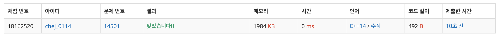

## 문제
- 백준 14501 : 퇴사
- 부르트포스
- DP
- https://www.acmicpc.net/problem/14501

<br/>

## 풀이
- 첫째날 >> 마지막날 보다 마지막날 >> 첫째날 으로 거꾸로 생각하고 풀면 쉽다.

|  |1일|2일|3일|4일|5일|6일|7일|
|--|--|--|--|--|--|--|--|
|Ti|3|5|1|1|2|4|2|
|Pi|10|20|10|20|15|40|200|

- N+1일 부터는 일을 할 수 없으므로 최대 이익은 0이다. ( ``` i+t[i] >= n ``` )
- N일 + 그 다음 최대 이익 과 N일에 일을 하지 않은 N-1일 까지의 최대 이익의 비교를 통해 최댓값을 구한다.   
``` max(dp[i+1], p[i]+dp[i+t[i]]) ```

<br/>

## 코드

```c++
#include <iostream>

#define MAX 16

using namespace std;

int n;
int t[MAX], p[MAX], dp[MAX] = {0,};

int max(int a, int b){
    return a > b ? a : b;
}

int main(void){
    
    cin >> n;
    for(int i=1; i<=n; i++){
        cin >> t[i];
        cin >> p[i];
    }
    
    for(int i=n; i>0; i--){
        if(i+t[i]>n+1){
            dp[i] = dp[i+1];
        } else {
            dp[i] = max(dp[i+1], p[i] + dp[i+t[i]]);
        }
    }
    
    cout << dp[1] << endl;
    
    return 0;
}
```

<br/>

## screenshot

