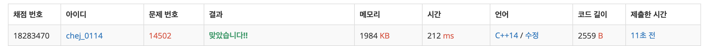

## 문제
- 백준 14502 : 연구소
- BFS
- 브루트 포스
- DFS
- https://www.acmicpc.net/problem/14502

<br/>

## 풀이
- 빈 칸인 곳에(``` map[i][j] == 0 ```) 재귀 호출을 사용해 총 세 군데에 벽을 세운다.   
이 때 재귀 호출을 한 뒤, 함수 실행이 끝나면 다시 벽을 무너뜨려야 한다. (다시 처음부터 벽을 세우기 때문)
- 벽을 모두 세우면 copymap 에 복사해둔 뒤, 바이러스가 퍼진 곳에 대해 (``` map[i][j] == 2 ```) BFS 탐색을 시작한다.
- 계속 시간초과가 떠서 삽질을 했는데, MAX값을 제대로 설정하지 않아서였다. 문제를 꼼꼼히 읽자..!

<br/>

## 코드

```c++
#include <iostream>
#include <vector>
#include <queue>
#define MAX 9

using namespace std;

int n, m;
int ans = 0;
int map[MAX][MAX], copymap[MAX][MAX];

const int dy[4] = {-1,1,0,0};
const int dx[4] = {0,0,-1,1};

vector<pair<int,int>> vec;
queue<pair<int,int>> q;

int max(int a, int b){
    return a > b ? a : b;
}

void bfs(){
    queue<pair<int,int>> que;
    
    for(int i=0; i<vec.size(); i++){
        que.push(make_pair(vec[i].first, vec[i].second));
    }
   
    while(!que.empty()){
        int y = que.front().first;
        int x = que.front().second;
        
        que.pop();

        for(int i=0; i<4; i++){
            int ny = y + dy[i];
            int nx = x + dx[i];

            if(ny<0 || nx<0 || ny>=n || nx>=m) continue;
            if(copymap[ny][nx]==1) continue;
            if(copymap[ny][nx]==0){
                copymap[ny][nx] = 2; // 감염 처리
                que.push(make_pair(ny, nx));
            }
        }
    }

    int size = 0;

    for(int i=0; i<n; i++){
        for(int j=0; j<m; j++){
            if(copymap[i][j]==0) size++;
        }
    }

    ans = max(ans, size);
    
}

void makewall(int cnt){
    if(cnt==3){ // 벽 다 세움 -> copymap 에 벽 복사
        for(int i=0; i<n; i++){
            for(int j=0; j<m; j++){
                copymap[i][j] = map[i][j];
            }
        }
        bfs(); // 바이러스 탐색 시작
        
    } else { // 아직 벽을 다 세우지 않음 -> 재귀 호출로 벽을 더 세움
        for(int i=0; i<n; i++){
            for(int j=0; j<m; j++){
                if(map[i][j] == 0){
                    map[i][j] = 1;
                    makewall(cnt+1);
                    map[i][j] = 0;
                }
            }
        }
    }
}

int main(void){
    ios::sync_with_stdio(false);
    cin.tie(0);
    cout.tie(0);
    
    cin >> n >> m;
    for(int i=0; i<n; i++){
        for(int j=0; j<m; j++){
            cin >> map[i][j];
            if(map[i][j]==2){
                vec.push_back({i,j});
            }
        }
    }
    
    for(int i=0; i<n; i++){
        for(int j=0; j<m; j++){
            if(map[i][j]==0){
                map[i][j] = 1;
                makewall(1);
                map[i][j] = 0;
            }
        }
    }
    
    cout << ans << endl;
    
    return 0;
}

```

<br/>

## screenshot

