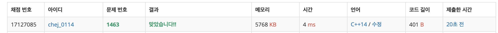

## 문제
- 백준 1463 : 1로 만들기
- BFS
- DP
- https://www.acmicpc.net/problem/1697


<br/>


## 풀이1 (BFS)
- 저번에 풀었던 [미로탐색](https://github.com/ChoiEunji0114/Algorithm-study/blob/master/posts/boj-2178.md) 과 유사한 문제라고 생각했다. 
- 입력한 수 ```n```이  ```1``` 에 도달하는 최단 경로를 구한다고 생각하고 풀었더니 간단히 BFS로 접근이 가능했다.


```c++
#include <iostream>
#include <queue>

using namespace std;

int main(void){

    int n;
    cin >> n;
    
    queue<pair<int,int>> que;
    que.push(make_pair(n, 0));
    
    while(!que.empty()){
        int num = que.front().first;
        int cnt = que.front().second;
        
        if(num==1) break;
        
        que.pop();
        
        if(num-1>=0) que.push(make_pair(num-1, cnt+1));
        if(num%3==0) que.push(make_pair(num/3, cnt+1));
        if(num%2==0) que.push(make_pair(num/2, cnt+1));
    }
    
    cout << que.front().second << endl;
   
    return 0;
}

```


<br/> <br/>


## 풀이2 (DP)
- BFS 보다 DP 로 접근하면 더욱 간단하게 문제를 풀 수 있다.
- ```d[i] = min(d[i/2]+1, d[i/3]+1, d[i-1]+1)``` 으로 차근차근 접근했다.


```c++
#include <iostream>

const int MAX = 1000001;
using namespace std;

int min(int a, int b){
    return a < b ? a : b;
}

int main(void){
    int n, d[MAX];
    cin >> n;
    
    d[1] = 0;
    
    for(int i=2; i<=n; i++){
        d[i] = d[i-1] + 1;
        if(i%2 == 0) d[i] = min(d[i/2]+1, d[i]);
        if(i%3 == 0) d[i] = min(d[i/3]+1, d[i]);
    }
    
    cout << d[n] << endl;
    return 0;
}
```

 
 
 - BFS 로 접근했을 때보다 메모리와 시간이 훨씬 절약됨을 알 수 있다.
 
 
 
 <br/>
 
 
 
 
