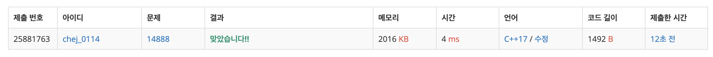

## 문제
- 백준 14888 : 연산자 끼워넣기
- 부르트포스
- https://www.acmicpc.net/problem/14888

<br/>

## 풀이
`solve(vec, index, cur, plus, minus, mul, div)` 함수를 사용해 최대값, 최소값을 구한다.

-  `vec` : 입력으로 주어진 수열
- `index` : 현재 계산해야 하는 인덱스
- `cur` : `index-1` 번까지 계산한 결과
- `plus`, `minus`, `mul`, `div`  : 사용할 수 있는 연산자의 갯수

<br/>

## 코드

```c++
#include <iostream>
#include <vector>
#include <algorithm>

using namespace std;

// 최대값, 최소값 리턴
pair<int,int> solve(vector<int> &vec, int index, int cur, int plus, int minus, int mul, int div){
    int n = vec.size();
    if(index == n){ // 모두 탐색 완료 -> 종료
        return make_pair(cur, cur);
    }
    
    vector<pair<int,int>> v;
    if(plus>0){
        v.push_back(solve(vec, index+1, cur+vec[index], plus-1, minus, mul, div));
    }
    if(minus>0){
        v.push_back(solve(vec, index+1, cur-vec[index], plus, minus-1, mul, div));
    }
    if(mul>0){
        v.push_back(solve(vec, index+1, cur*vec[index], plus, minus, mul-1, div));
    }
    if(div>0){
        v.push_back(solve(vec, index+1, cur/vec[index], plus, minus, mul, div-1));
    }
    
    auto ans = v[0];
    for(auto p: v){
        if(ans.first < p.first) ans.first = p.first; // 최대값 업데이트
        if(ans.second > p.second) ans.second = p.second; // 최소값 업데이트
    }
    
    return ans;
}


int main(void){
    
    ios::sync_with_stdio(false);
    cin.tie(0); cout.tie(0);
    
    int n;
    cin >> n;
    
    vector<int> vec(n);
    for(int i=0; i<n; i++){
        cin >> vec[i];
    }
    
    int plus, minus, mul, div;
    cin >> plus >> minus >> mul >> div;
    
    // 최대값, 최소값 출력
    auto answer = solve(vec, 1, vec[0], plus, minus, mul, div);
    cout << answer.first << '\n';
    cout << answer.second << '\n';
    
    return 0;
}

```
<br/>


## screenshot



