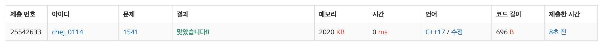

## 문제
- 백준 1541 : 잃어버린 괄호
- Greedy
- https://www.acmicpc.net/problem/1541

<br/>

## 풀이
- 연속해서 같은 연산자가 나오지 않으므로 + 가 나온 다음엔 -가 나오고, -가 나온 다음엔 +가 나온다.

- 연산자가 나온 + 는 괄호를 통해 묶을 수 있다.

  ```
  100 + 20 - (30 + 60) - (20 + 40)
  ```

  그러므로 처음 나온 연산자가 -면 전부 -처리해주면 되고, 

  +면 한번 +연산해주고, 그다음 부터는 모든 값들을 - 연산해주면 된다.

<br/>

## 코드

```c++
#include <iostream>
#include <string>

using namespace std;

int main(void){
    
    ios::sync_with_stdio(false);
    cin.tie(0); cout.tie(0);
    
    string str;
    string tmp = "";
    int result = 0;
    bool minus = false;
    
    cin >> str;
    for(int i=0; i<=str.size(); i++){
        // 연산자일 경우
        if(str[i]=='+' || str[i]=='-' || str[i]=='\0'){
            if(minus) result -= stoi(tmp);
            else result += stoi(tmp);
            
            tmp = ""; // 초기화
            if(str[i]=='-') minus = true;
            continue;
        }
        // 피연산자일 경우
        tmp += str[i];
    }
    
    cout << result << '\n';
    
    return 0;
}

```

<br/>


## screenshot


