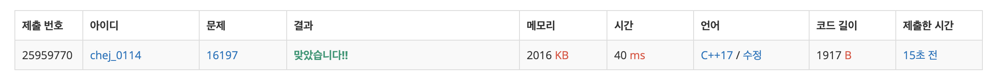

## 문제
- 백준 16197 : 두 동전
- https://www.acmicpc.net/problem/16197
- 부르트포스

<br/>

## 풀이1

```c++
#include <iostream>
#define MAX 21

using namespace std;

int n, m;
char map[MAX][MAX];
bool visited[MAX][MAX][MAX][MAX], is_saved;
int coin_y1, coin_x1, coin_y2, coin_x2;
int ans = 987654321;

const int dy[4] = {-1,1,0,0};
const int dx[4] = {0,0,-1,1};

int min(int a, int b){
    return a < b ? a : b;
}

void solve(int y1, int x1, int y2, int x2, int cnt){
    // 11회 이상 이동 -> 종료
    if(cnt>=11) return;

    // 이미 방문한 경우 -> 종료
    if(visited[y1][x1][y2][x2]) return;

    bool is_out1 = false, is_out2 = false;
    if(y1<0 || x1<0 || y1>=n || x1>=m) is_out1 = true;
    if(y2<0 || x2<0 || y2>=n || x2>=m) is_out2 = true;

    // 동전 둘 다 떨어짐 -> 종료
    if(is_out1 && is_out2) return;

    // 동전 하나만 떨어짐 -> 답 업데이트 후 종료
    if((is_out1 && !is_out2) || (!is_out1 && is_out2)) {
        ans = min(ans, cnt);
        return;
    }

    // 탐색 시작
    visited[y1][x1][y2][x2] = true;
    for(int i=0; i<4; i++){
        int ny1 = y1; int ny2 = y2;
        int nx1 = x1; int nx2 = x2;

        // 벽 검사
        if(map[ny1+dy[i]][nx1+dx[i]] != '#'){
            ny1 += dy[i]; nx1 += dx[i];
        }
        if(map[ny2+dy[i]][nx2+dx[i]] != '#'){
            ny2 += dy[i]; nx2 += dx[i];
        }

        solve(ny1, nx2, ny2, nx2, cnt+1);
    }
    visited[y1][x1][y2][x2] = false;
}


int main(void){

    ios::sync_with_stdio(false);
    cin.tie(0); cout.tie(0);

    cin >> n >> m;
    for(int i=0; i<n; i++){
        for(int j=0; j<m; j++){
            cin >> map[i][j];
            if(map[i][j]=='o' && !is_saved){
                coin_y1 = i; coin_x1 = j;
                map[i][j] = '.';
                is_saved = true;
            } else if (map[i][j]=='o' && is_saved){
                coin_y2 = i; coin_x2 = j;
                map[i][j] = '.';
            }
        }
    }

    solve(coin_y1, coin_x1, coin_y2, coin_x2, 0);

    if(ans == 987654321) cout << -1 << '\n';
    else cout << ans << '\n';

    return 0;
}

```

답이 나왔다 안 나왔다 하는 오답 ㅠㅠ 

동전의 좌표와 이동 거리를 매개변수로 호출하는 접근법까지는 좋았으나, 방문 표시 `visited` 의 부적절한 사용과 아무것도 리턴하지 않는 방법이 오답의 원인 같다.. 

<br/>

## 풀이2

```c++
#include <iostream>
#define MAX 21

using namespace std;

int n, m;
char map[MAX][MAX];
int coin_y1, coin_x1, coin_y2, coin_x2; // 동전 좌표

const int dy[4] = {-1,1,0,0};
const int dx[4] = {0,0,-1,1};

int solve(int y1, int x1, int y2, int x2, int cnt){
    // 11회 이상 이동 -> 종료
    if(cnt>=11) return -1;
    
    bool is_out1 = false, is_out2 = false;
    if(y1<0 || x1<0 || y1>=n || x1>=m) is_out1 = true;
    if(y2<0 || x2<0 || y2>=n || x2>=m) is_out2 = true;
    
    // 동전 둘 다 떨어짐 -> 종료
    if(is_out1 && is_out2) return -1;
    
    // 동전 하나만 떨어짐 -> 답 업데이트 후 cnt 리턴 후 종료
    if(is_out1 || is_out2) return cnt;
    
    // 탐색 시작
    int ans = -1;
    for(int i=0; i<4; i++){
        int ny1 = y1 + dy[i];
        int nx1 = x1 + dx[i];
        int ny2 = y2 + dy[i];
        int nx2 = x2 + dx[i];
        
        // 벽 검사 (이동하려는 곳이 벽이면 이동하지 않음)
        if(map[ny1][nx1] == '#') {
            ny1 = y1; nx1 = x1;
        }
        if(map[ny2][nx2] == '#') {
            ny2 = y2; nx2 = x2;
        }
        
        int tmp = solve(ny1, nx1, ny2, nx2, cnt+1);
        if(tmp == -1) continue;
        if(ans == -1 || ans > tmp){ // 최단 거리 업데이트
            ans = tmp;
        }
    }
    
    return ans;
}


int main(void){
    
    ios::sync_with_stdio(false);
    cin.tie(0); cout.tie(0);
    
    cin >> n >> m;
    coin_y1 = coin_x1 = coin_y2 = coin_x2 = -1;
    
    for(int i=0; i<n; i++){
        for(int j=0; j<m; j++){
            cin >> map[i][j];
            if(map[i][j]=='o'){
                if(coin_y1 == -1){
                    coin_y1 = i; coin_x1 = j;
                } else {
                    coin_y2 = i; coin_x2 = j;
                }
                map[i][j] = '.';
            }
        }
    }
    
    cout << solve(coin_y1, coin_x1, coin_y2, coin_x2, 0) << '\n';
    return 0;
}

```

방문 표시를 하지 않고, 부적절한 곳의 방문은 -1을, 유의미한 스텝인 경우 최솟값 이동 거리를 리턴하도록 했다. 결과는 성공!

<br/>

## screenshot



