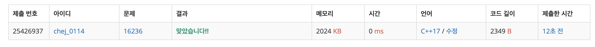

## 문제
- 백준 16236 : 아기 상어
- BFS
- 완전 탐색
- https://www.acmicpc.net/problem/16236

<br/>

## 풀이

1. 아기 상어는 자신의 크기 이하인 곳으로만 이동이 가능하다.
2. 아기 상어는 자신보다 작은 크기의 물고기만 먹는다.
3. 아기 상어는 가장 가까운 거리의 물고기를 먹는다.
4. 아기 상어는 자신의 크기와 같은 수의 물고기를 먹으면 크기가 증가한다.

<br/>

## 코드

```c++
#include<iostream>
#include<queue>
#include<vector>
#include<algorithm>

using namespace std;

#define MAX 21
#define MIN 987654321

int N;
int result = 0;

int Baby_x, Baby_y; // 상어 좌표
int eat_count = 0; // 상어가 잡아먹은 물고기 개수
int baby_size = 2; // 상어 크기
int eat_distance;

int arr[MAX][MAX], visit[MAX][MAX];
vector <pair <pair<int, int>, int>> Eat; // 먹을 수 있는 물고기의 거리, x좌표, y좌표

const int dx[4] = { 0, 0, -1, 1 };
const int dy[4] = { -1, 1, 0, 0 };

void BFS(int init_x, int init_y) {
    // 탐색 초기화
    eat_distance = MIN;
    Eat.clear();
    memset(visit, 0, sizeof(visit));
    queue<pair<int, int>> que;
    que.push(make_pair(init_x, init_y));

    // 상어 탐색 시작 - 가장 가까운 거리 찾기
    while (!que.empty()) {
        int x = que.front().first;
        int y = que.front().second;
        que.pop();

        for (int i=0; i< 4; i++) {
            int nx = x + dx[i]; int ny = y + dy[i];
            
            if (0 > nx || N <= nx || 0 > ny || N <= ny) continue;
            if (visit[nx][ny] == 0 && baby_size >= arr[nx][ny]) { // 자기보다 큰 물고기 자리 못감
                visit[nx][ny] = visit[x][y] + 1; // 경로 저장
                if (arr[nx][ny] > 0 && arr[nx][ny] < baby_size) { // 자기보다 작은 물고기 잡아먹음
                    if (eat_distance >= visit[nx][ny]) { // 최단 경로 업데이트
                        eat_distance = visit[nx][ny];
                        Eat.push_back(make_pair(make_pair(eat_distance, nx), ny));
                    }
                }
                que.push(make_pair(nx, ny));
            }
        }
    }
}

int main() {
    ios::sync_with_stdio(false);
    cin.tie(0); cout.tie(0);
    cin >> N;

    for (int i = 0; i < N; i++) {
        for (int j = 0; j < N; j++) {
            cin >> arr[i][j];
            if (arr[i][j] == 9) { // 아기상어 좌표 저장
                arr[i][j] = 0;
                Baby_x = i; Baby_y = j;
            }
        }
    }
    
    while (true) {
        BFS(Baby_x, Baby_y);

        if (Eat.empty()) break;
        else {
            sort(Eat.begin(), Eat.end()); // 가장 가까운 거리, 위에 있는 물고기, 왼쪽에 있는 물고기 순으로 정렬
            eat_count++;
            result += Eat[0].first.first;
            arr[Eat[0].first.second][Eat[0].second] = 0;
            Baby_x = Eat[0].first.second; Baby_y = Eat[0].second;
            if (baby_size == eat_count) {
                baby_size++; eat_count = 0;
            }
        }
    }
    
    cout << result << '\n';
    
    return 0;
}
```

<br/>

## Screenshot



