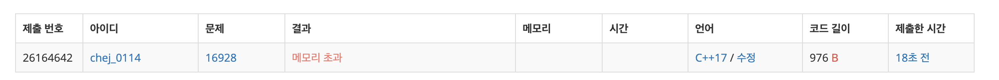
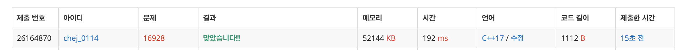

## 문제
- 백준 16928 : 뱀과 사다리 게임
- BFS
- DFS
- https://www.acmicpc.net/problem/16918

<br/>

## 풀이 1 (메모리 초과)
```c++
#include <iostream>
#include <queue>
#define MAX 101

int n, m;
int step[MAX];

using namespace std;

int main(void){
    
    ios::sync_with_stdio(false);
    cin.tie(0); cout.tie(0);
    
    cin >> n >> m;

    int num1, num2;
    while(n--){
        cin >> num1 >> num2;
        step[num1] = num2;
    }
    while(m--){
        cin >> num1 >> num2;
        step[num1] = num2;
    }
    
    queue<pair<int,int>> que; // 위치, 주사위 굴린 갯수
    que.push(make_pair(1, 0));
    
    while(!que.empty()){
        int cnt = que.front().second;
        int pos = que.front().first;
        if(step[pos] != 0){ // 주사위 위치 업데이트
            pos = step[pos];
        }
        que.pop();
        
        // 도착한 경우
        if(pos==100){
            cout << cnt << '\n';
            break;
        }
        
        for(int i=1; i<=6; i++){
            int npos = pos + i;
            if(npos>100) continue;
            que.push(make_pair(npos, cnt+1));
        }
    }
    
    return 0;
}
```



접근 방법도 좋았고 답도 잘 나왔으나 메모리 초과가 나왔던 풀이법 .. ㅠㅠ 곰곰이 생각해보니 **방문 처리** 를 하지 않았다..!

<br/>

## 풀이2

```c++
#include <iostream>
#include <queue>
#define MAX 101

int n, m;
int step[MAX];
bool visited[MAX];

using namespace std;

int main(void){
    
    ios::sync_with_stdio(false);
    cin.tie(0); cout.tie(0);
    
    cin >> n >> m;

    int num1, num2;
    while(n--){
        cin >> num1 >> num2;
        step[num1] = num2;
    }
    while(m--){
        cin >> num1 >> num2;
        step[num1] = num2;
    }
    
    queue<pair<int,int>> que; // 위치, 주사위 굴린 갯수
    que.push(make_pair(1, 0));
    
    while(!que.empty()){
        int cnt = que.front().second;
        int pos = que.front().first;
        if(step[pos] != 0){ // 주사위 위치 업데이트
            pos = step[pos];
        }
        visited[pos] = true;
        que.pop();
        
        // 도착한 경우
        if(pos==100){
            cout << cnt << '\n';
            break;
        }
        
        for(int i=1; i<=6; i++){
            int npos = pos + i;
            if(npos>100) continue;
            if(visited[npos]) continue;
            que.push(make_pair(npos, cnt+1));
        }
    }
    
    return 0;
}

```



`visited` 배열을 추가해 방문 표시를 했더니 메모리 초과 문제 해결❗️쉬운 BFS 문제인데 삽질할 뻔 했다 .. ㅎㅎ