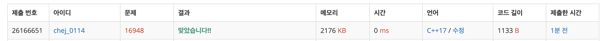

## 문제
- 백준 16948 : 데스 나이트
- BFS
- DFS
- https://www.acmicpc.net/problem/16948

<br/>

## 풀이
- [백준 7562: 나이트의 이동](https://github.com/ChoiEunji0114/Algorithm-study/blob/master/posts/boj-7562.md) 와 매우 비슷했던 문제! 
- 위 풀이처럼 queue 에 좌표와 이동 횟수를 저장하면 메모리 초과 에러가 나와서 이동 횟수를 저장하는 배열 `cnt` 를 만들어 처리했더니 오류가 해결 되었다 ㅎㅎ

<br/>

## 코드

```c++
#include <iostream>
#include <cstring>
#include <queue>
#define MAX 201

using namespace std;

int cnt[MAX][MAX];
int n, start_y, start_x, end_y, end_x;

const int dy[6] = {-2,-2,0,0,2,2};
const int dx[6] = {-1,1,-2,2,-1,1};

int main(void){
    
    ios::sync_with_stdio(false);
    cin.tie(0); cout.tie(0);
    memset(cnt, -1, sizeof(cnt));
    
    cin >> n;
    cin >> start_y >> start_x >> end_y >> end_x;
    
    queue<pair<int,int>> que;
    que.push(make_pair(start_y, start_x));
    cnt[start_y][start_x] = 0;
    
    while(!que.empty()){
        int y = que.front().first;
        int x = que.front().second;
        que.pop();
        
        // 도착한 경우
        if(y==end_y && x==end_x){
            break;
        }
        
        for(int i=0; i<6; i++){
            int ny = y + dy[i];
            int nx = x + dx[i];
            
            if(ny<0 || nx<0 || ny>=n || nx>=n) continue;
            if(cnt[ny][nx]==-1){
                cnt[ny][nx] = cnt[y][x] + 1;
                que.push(make_pair(ny, nx));
            }
        }
    }
    
    cout << cnt[end_y][end_x] << '\n';
    
    return 0;
}

```

<br/>


## screenshot

