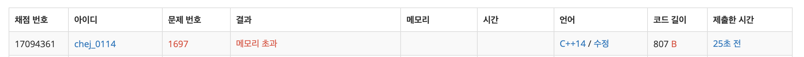
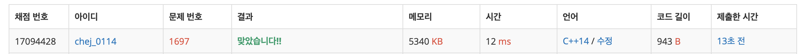

## 문제
- 백준 1697 : 숨바꼭질
- https://www.acmicpc.net/problem/1697
- BFS 


<br/>


## 풀이
- 너무 쉬운데..? 하면서 풀다가 보기 좋게 메모리 초과가 떴다 ,, 🤯

```c++
#include <iostream>
#include <queue>

using namespace std;

int main(void){
    
    int n, k; // 수빈이 위치, 동생 위치
    cin >> n >> k;
    
    queue<pair<int,int>> que;
    
    que.push(make_pair(n, 0));
    
    while(!que.empty()){
        
        int pos = que.front().first;
        int depth = que.front().second;
        
        if(pos == k) break;
        
        que.pop();
        
        if(pos-1>=0) que.push(make_pair(pos-1, depth+1));
        if(pos+1>=0) que.push(make_pair(pos+1, depth+1));
        if(pos*2>=0) que.push(make_pair(pos*2, depth+1));
    
    }
    
    cout << que.front().second << endl;
    
    return 0;
}


```



- 문제가 뭘까...? 하고 생각했는데 **방문 표시를 하지 않았다** (재방문하는 지점이 있다)
- 새로운 방문 지점에 대해 조건을 잘못 걸었다. `pos+1` 이나 `pos*2` 같은 경우는 0보다 작을 일이 없기 때문이다. 
- 방문 지점을 체크하고, 조건을 수정해보았다.

<br/> <br/>


```c++
#include <iostream>
#include <queue>

const int MAX = 100001;

using namespace std;

int main(void){
    
    int n, k; // 수빈이 위치, 동생 위치
    cin >> n >> k;
    
    queue<pair<int,int>> que;
    bool visited[MAX] = {0,};
    
    que.push(make_pair(n, 0));
    
    while(!que.empty()){
        
        int pos = que.front().first;
        int depth = que.front().second;
        
        if(pos == k) break;
        
        que.pop();
        visited[pos] = true;
        
        if(pos-1>=0 && !visited[pos-1]) que.push(make_pair(pos-1, depth+1));
        if(pos+1<=MAX && !visited[pos+1]) que.push(make_pair(pos+1, depth+1));
        if(pos*2<=MAX && !visited[pos*2]) que.push(make_pair(pos*2, depth+1));
    
    }
    
    cout << que.front().second << endl;
    
    return 0;
}

```

 
 
 - 결과 성공 〰️‼️
 
 
 
 <br/>
 
 
 
 
 ## 반성
 - 조건은 생각하고 걸자,,
 - 런타임에러나 메모리에러가 자주 나는 편이라 방문 조건은 안 거는게 오히려 메모리에 좋을 거라고 생각했었던 게 실수..! 
 
 
