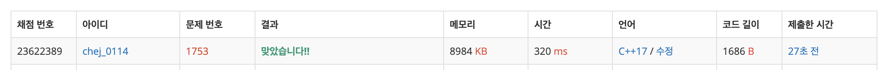

## 문제
- 백준 1753 : 최단경로
- 다익스트라
- 그래프
- https://www.acmicpc.net/problem/1753

<br/>

## 풀이
- **다익스트라 알고리즘** 을 사용해야 풀 수 있는 문제이다.
    
    > 다익스트라 알고리즘은 그래프의 '최소 비용' 을 구해야 하는 경우 사용되는 알고리즘이다. 최소 비용 중에서도, 시작노드~도착노드 사이의 최소 비용인 경로를 찾을 때 유용하게 사용된다.
    
    
    
- 비용이 **최소** 인 노드부터 방문하기 위해 **우선순위 큐** 에 비용을 **음수처리**  해야 한다. (기본적으로 값이 큰 순서대로 우선순위를 부여하기 때문)

- 덧. 처음에 시간초과가 났으나 `endl` 을 사용하지 않고 출력값 끝에 `\n` 을 붙였더니 해결되었다. `endl` 가 메모리 많이 잡아 먹는다고 어디선가 본 기억이 있는데 중요성을 간과했다.. ㅠㅠ 

<br/>

## 코드

```c++
#include <iostream>
#include <vector>
#include <queue>

#define MAX 20001
#define INF 987654321

using namespace std;

int V, E, K; // 정점 개수, 간선 개수, 시작 정점
vector<pair<int,int>> graph[MAX];

// 다익스트라 알고리즘
vector<int> dikstra(int start, int vertex){
    vector<int> distance(vertex, INF); // 처음은 무한대로 초기화
    distance[start] = 0; // 자기 자신에게 가는 비용
    
    priority_queue<pair<int, int>> pq; // cost, vertex
    pq.push(make_pair(0, start)); // 초기 비용, 시작점
    
    while(!pq.empty()){
        int cost = -pq.top().first; // 우선 순위 큐에 음수 처리
        int curvertex = pq.top().second;
        pq.pop();
        
        if(distance[curvertex] < cost) continue;
        
        // 인접 경로 확인
        for(int i=0; i<graph[curvertex].size(); i++){
            int neighbor = graph[curvertex][i].first;
            int neighbordist = cost + graph[curvertex][i].second;
            
            // 최소 경로 발견시 업데이트
            if(distance[neighbor] > neighbordist){
                distance[neighbor] = neighbordist;
                pq.push(make_pair(-neighbordist, neighbor));
            }
        }
    }
    
    return distance;
}

int main(void){
    
    cin >> V >> E;
    cin >> K;
    
    V++;
    
    for(int i=0; i<E; i++){
        int source, destination, cost;
        cin >> source >> destination >> cost;
        
        graph[source].push_back(make_pair(destination, cost));
    }
    
    vector<int> result = dikstra(K, V);
    
    for(int i=1; i<V; i++){
        if(result[i]==INF) cout << "INF\n";
        else cout << result[i] << "\n";
    }
    
    return 0;
}

```

<br/>

## screenshot

