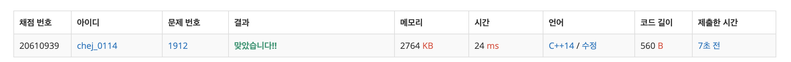

## 문제
- 백준 1912 : 연속합
- DP
- Greedy
- https://www.acmicpc.net/problem/1912

<br/>

## 풀이

- 정말 오랜만에 풀었던 알고리즘 문제,, 그리디인 줄 알았으나 DP로도 풀린다.

```c++
    dp[i] = max(dp[i-1]+arr[i], arr[i]);
```

정말 간단한 점화식만 구하면 쉽게 풀 수 있다. 


<br/>

## 코드

```c++
#include <iostream>
#define MAX 100000

using namespace std;

int n, ans;
int arr[MAX], dp[MAX]; // dp : 가장 큰 연속합

int max(int a, int b){
    return a >= b ? a : b;
}

int main(void){

    cin >> n;
    
    for(int i=0; i<n; i++){
        cin >> arr[i];
    }
    
    dp[0] = arr[0]; // 첫째 줄은 정수이므로 0번째 가장 큰 합은 arr[0]이다.
    ans = dp[0];
    
    for(int i=1; i<n; i++){
        dp[i] = max(dp[i-1]+arr[i], arr[i]);
        ans = max(ans, dp[i]);
    }
    
    cout <<  ans << endl;
    
    
    return 0;
}

```

<br/>

## screenshot

