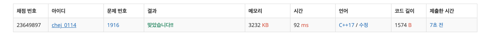

## 문제
- 백준 1916 : 최소비용 구하기
- 다익스트라
- 그래프
- https://www.acmicpc.net/problem/1916

<br/>

## 풀이
- 저번에 푼 [최단 경로](https://github.com/choidam/Algorithm-study/blob/master/posts/boj-1753.md) 문제와 매우 흡사하다.
  
- 비용이 **최소** 인 노드부터 방문하기 위해 **우선순위 큐** 에 비용을 **음수처리**  해야 한다. (기본적으로 값이 큰 순서대로 우선순위를 부여하기 때문)

- 정점이 1부터 시작하므로 정점개수에 1더해야 한다. (안하니 원하는 답이 나오지 않는다..)

<br/>

## 코드

```c++
#include <iostream>
#include <vector>
#include <queue>
#define MAX 1001
#define INF 987654321

using namespace std;

int n, m; // 정점 개수, 간선 개수
vector<pair<int,int>> graph[MAX]; // 연결 정점, 비용
int source, destination; // 시작 정점, 도착 정점

// 다익스트라 알고리즘
vector<int> dikstra(int start, int vertex){
    vector<int> distance(vertex, INF); // 처음은 무한대로 초기화
    distance[start] = 0; // 자기 자신에게 가는 비용

    priority_queue<pair<int, int>> pq; // cost, vertex
    pq.push(make_pair(0, start)); // 초기 비용, 시작점

    while(!pq.empty()){
        int cost = -pq.top().first;
        int curvertex = pq.top().second;
        pq.pop();

        if(distance[curvertex] < cost) continue;

        // 인접 경로 확인
        for(int i=0; i<graph[curvertex].size(); i++){
            int neighbor = graph[curvertex][i].first;
            int neighbordist = cost + graph[curvertex][i].second;

            // 최소 경로 발견시 업데이트
            if(distance[neighbor] > neighbordist){
                distance[neighbor] = neighbordist;
                pq.push(make_pair(-neighbordist, neighbor));
            }
        }
    }

    return distance;
}

int main(void){

    cin >> n >> m;
    n++;
    
    for(int i=0; i<m; i++){
        int start, end, cost;
        cin >> start >> end >> cost;
        graph[start].push_back(make_pair(end, cost));
    }
    cin >> source >> destination;

    vector<int> result = dikstra(source, n);

    cout << result[destination] << endl;

    return 0;
}

```

<br/>

## screenshot


