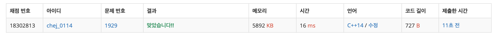

## 문제
- 백준 1929 : 소수 구하기
- 에라토스테네스의 체
- https://www.acmicpc.net/problem/1929

<br/>

## 풀이
- 단순 소수 찾기로 구하면 메모리 초과가 발생한다. 에라토스테네스의 체 알고리즘을 사용해야 한다!
- [에라토스테네스의 체](https://github.com/ChoiEunji0114/TIL/blob/master/algorithm/erathosthenes.md) 에 대해 정확한 이해가 필요하다.

<br/>

## 코드

```c++
#include <iostream>
#define MAX 1000001
using namespace std;

int m, n;
int arr[MAX];

void erathosthenes(){
    
    arr[0] = arr[1] = -1; // 0,1 : 소수 아님
    for(int i=2; i<MAX; i++){
        arr[i] = i;
    }
    
    for(int i=2; i*i<=MAX; i++){
        if(arr[i] == i){ // 아직 지워지지 않았을 경우
            for(int j=i*i; j<MAX; j+=i){ // j = i^2 + (i*n)
                if(arr[j] == j){
                    arr[j] = i; // i의 배수임을 표시 (소수가 아님)
                }
            }
        }
    }
}

int main(void){
    
    cin >> m >> n;
    
    erathosthenes();
    
    for(int i=m; i<=n; i++){
        if(arr[i]==i)
            cout << i << "\n";
    }
    
    return 0;
}

```

<br/>

## screenshot

