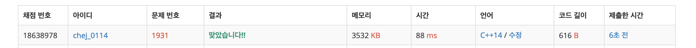

## 문제
- 백준 1931 : 회의실배정
- https://www.acmicpc.net/problem/1931
- Greedy

<br/>

## 풀이
- 그리디 알고리즘의 [활동 선택 문제](https://github.com/ChoiEunji0114/TIL/blob/master/algorithm/greedy.md) 를 응용한 문제다.
- 최적의 해를 구하기 위해서 첫 번째 회의가 최대한 일찍 끝나 한다.   
그러므로 회의가 끝나는 순대로 먼저 오름차순 하고 ( ``` sort(v.begin(), v.end()) ``` ),   
그 다음 중복되지 않는 회의 중에서 회의가 먼저 끝나는 회의를 차례대로 뽑으며 반복한다.

<br/>

## 코드
```c++
#include <iostream>
#include <vector>
#include <algorithm>

using namespace std;

int n;
vector <pair<int,int>> v;

int main(void){
    
    cin >> n;
    int start, end;
    for(int i=0; i<n; i++){
        cin >> start >> end;
        v.push_back(make_pair(end, start));
    }
    
    sort(v.begin(), v.end());
    
    int tmpEnd = v[0].first;
    int cnt = 1;
    
    for(int i=1; i<n; i++){
        if(tmpEnd <= v[i].second){
            cnt++;
            tmpEnd = v[i].first;
        }
    }
    
    cout << cnt << endl;
    
    return 0;
}

```

<br/>

## screenshot


