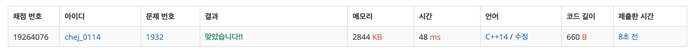

## 문제
- 백준 1932 : 정수 삼각형
- https://www.acmicpc.net/problem/1932
- DP

<br/>

## 풀이
- [땅따먹기](https://github.com/ChoiEunji0114/Algorithm-study/blob/master/posts/programmers_12913.md) 문제와 비슷한 DP 문제
- 선택할 수 있는 최대값 (`max(arr[i-1][j], arr[i-1][j-1])`) 을 선택하며 순회한다.

<br/>

## 코드
```c++
#include <iostream>
#define MAX 501

using namespace std;

int max(int a, int b){
    return a>b ? a : b;
}

int main(void){
    
    int n, arr[MAX][MAX];
    cin >> n;
    for(int i=0; i<n; i++){
        for(int j=0; j<i+1; j++){
            cin >> arr[i][j];
        }
    }
    
    for(int i=1; i<=n; i++){
        for(int j=0; j<n; j++){
            if(j==0){
                arr[i][j] += arr[i-1][j];
            } else {
                arr[i][j] += max(arr[i-1][j], arr[i-1][j-1]);
            }
        }
    }
    
    int ans = 0;
    for(int i=0; i<n; i++){
        ans = max(ans, arr[n-1][i]);
    }
    cout << ans << endl;
    
    return 0;
}

```

<br/>

## screenshot


