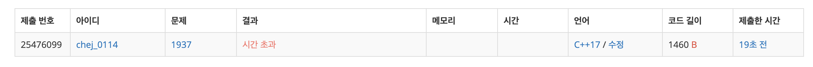
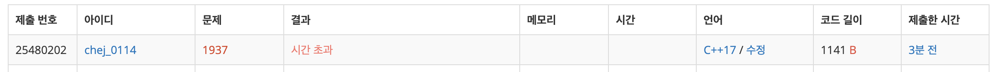
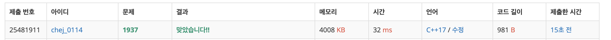

## 문제
- 백준 1937 : 욕심쟁이 판다
- https://www.acmicpc.net/problem/1937
- DFS
- DP

<br/>

## 풀이1 (시간 초과)
```c++
#include <iostream>
#include <queue>
#include <cstring>
#define MAX 501

using namespace std;

int n, map[MAX][MAX], ans;
bool visited[MAX][MAX];
int sum[MAX][MAX]; // 판다 경로 저장

const int dy[4] = {-1,1,0,0};
const int dx[4] = {0,0,-1,1};

int max(int a, int b){
    return a > b ? a : b;
}

void bfs(int init_y, int init_x){
    memset(visited, false, sizeof(visited));
    memset(sum, 0, sizeof(sum));
    visited[init_y][init_x] = true;
    
    queue<pair<int,int>> que;
    que.push(make_pair(init_y, init_x));
     
    while(!que.empty()){
        int y = que.front().first;
        int x = que.front().second;
        que.pop();
        
        for(int i=0; i<4; i++){
            int ny = y + dy[i];
            int nx = x + dx[i];
            
            if(ny<0 || nx<0 || ny>=n || nx>=n) continue;
            if(!visited[ny][nx] && map[ny][nx]>map[y][x]){
                visited[ny][nx] = true;
                sum[ny][nx] = sum[y][x]+1;
                ans = max(ans, sum[ny][nx]);
                que.push(make_pair(ny, nx));
            }
        }
        
    }
}

int main(void){
    
    ios::sync_with_stdio(false);
    cin.tie(0); cout.tie(0);
    
    cin >> n;
    
    for(int i=0; i<n; i++){
        for(int j=0; j<n; j++){
            cin >> map[i][j];
        }
    }
  
    for(int i=0; i<n; i++){
        for(int j=0; j<n; j++){
            bfs(i,j);
        }
    }
    
    cout << ans+1 << '\n';
    return 0;
}

```



완탐 BFS 방법으로 풀었더니 답은 나오지만 시간 초과 오류가 났다 ㅠㅠ  

<br/>

## 풀이2 (시간 초과)

```c++
#include <iostream>
#include <queue>
#include <cstring>
#define MAX 501

using namespace std;

int n, map[MAX][MAX], ans;
bool visited[MAX][MAX];
int sum[MAX][MAX]; // 판다 경로 저장

const int dy[4] = {-1,1,0,0};
const int dx[4] = {0,0,-1,1};

int max(int a, int b){
    return a > b ? a : b;
}

void dfs(int y, int x){
    visited[y][x] = true;
    
    for(int i=0; i<4; i++){
        int ny = y + dy[i];
        int nx = x + dx[i];
        
        if(ny<0 || nx<0 || ny>=n || nx>=n) continue;
        if(!visited[ny][nx] && map[ny][nx]>map[y][x]){
            sum[ny][nx] = sum[y][x]+1;
            ans = max(ans, sum[ny][nx]);
            dfs(ny,nx);
        }
    }
}

int main(void){
    
    ios::sync_with_stdio(false);
    cin.tie(0); cout.tie(0);
    
    cin >> n;
    for(int i=0; i<n; i++){
        for(int j=0; j<n; j++){
            cin >> map[i][j];
        }
    }
    
    for(int i=0; i<n; i++){
        for(int j=0; j<n; j++){
            memset(visited, false, sizeof(visited));
            memset(sum, 0, sizeof(sum));
            dfs(i, j);
        }
    }
    
    cout << ans+1 << '\n';
    
    return 0;
}
```



완탐 BFS 방법이 문제인가 싶어서 완탐DFS 방법으로 바꾸어 풀어보았다. 역시나 답은 잘 나오지만 시간 초과 오류가 났다..

<br/>

## 풀이3 (시간 초과 해결)

```c++
#include <iostream>
#define MAX 501

using namespace std;

int n, map[MAX][MAX], ans;
int sum[MAX][MAX]; 

const int dy[4] = {-1,1,0,0};
const int dx[4] = {0,0,-1,1};

int max(int a, int b){
    return a > b ? a : b;
}

int dfs(int y, int x){
    if(sum[y][x]) return sum[y][x];
    
    sum[y][x] = 1;
    for(int i=0; i<4; i++){
        int ny = y + dy[i];
        int nx = x + dx[i];
        
        if(ny<0 || nx<0 || ny>=n || nx>=n) continue;
        if(map[ny][nx]>map[y][x]){
            sum[y][x] = max(sum[y][x], dfs(ny,nx)+1);
        }
    }
    return sum[y][x];
}

int main(void){
    
    ios::sync_with_stdio(false);
    cin.tie(0); cout.tie(0);
    
    cin >> n;
    for(int i=0; i<n; i++){
        for(int j=0; j<n; j++){
            cin >> map[i][j];
        }
    }
    
    for(int i=0; i<n; i++){
        for(int j=0; j<n; j++){
            ans = max(ans, dfs(i, j));
        }
    }
    
    cout << ans << '\n';
    
    return 0;
}

```

BFS, DFS 가 문제가 아니라 '완전탐색' 이 문제였다. 이 문제는 DP 로 해결해야 한다.

배열 `sum[y][x]` 에는 판다가 (y,x) 좌표에 있을 때 **최대로 살 수 있는 날짜** 를 의미한다.

```c++
if(sum[y][x]) return sum[y][x];
```

이미 값이 있는 좌표는 더 이상 방문할 필요가 없으므로 리턴해준다. 

값이 있는 경우는 해당 좌표를 1로 설정하고 탐색을 진행해야 한다.

```c++
sum[y][x] = 1;
```

```c++
if(map[ny][nx]>map[y][x]){
      sum[y][x] = max(sum[y][x], dfs(ny,nx)+1);
}
```

<br/>

## Screenshot



