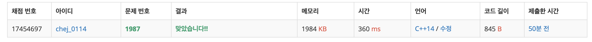

## 문제
- 백준 1987 : 알파벳
- DFS
- 백트래킹
- https://www.acmicpc.net/problem/1987

<br/>

## 풀이
- 이전에 방문하지 않은 지점이 있닥 하덜랃 그 지점이 이전에 방문한 지점의 알파벳과 같다면 방문할 수 없다.
- 즉, 포인트는 **방문한 위치가 아니라 방문한 지점의 알파벳** 이다.
- 방문한 지점의 알파벳은 ```int alphabet[65]``` 에 저장해 두었다.

<br/>

## 코드

```c++
#include <iostream>

using namespace std;

int r, c;
char board[21][21];
int alphabet[26];
int ans = 0;

const int dy[] = {-1,1,0,0};
const int dx[] = {0,0,-1,1};

int max(int a, int b){
    return a > b ? a : b;
}

void dfs(int y, int x, int cnt){
    ans = max(ans, cnt);
    
    for(int i=0; i<4; i++){
        int ny = y + dy[i];
        int nx = x + dx[i];
        int k = (int)board[ny][nx]-65;
        
        if(ny<0 || nx<0 || ny>=r || nx>=c) continue;
        if(alphabet[k]) continue;
        
        alphabet[k]++;
        dfs(ny,nx,cnt+1);
        alphabet[k]--;
    }
}

int main(void){
    
    cin >> r >> c;

    for(int i=0; i<r; i++){
        for(int j=0; j<c; j++){
            cin >> board[i][j];
        }
    }
    
    alphabet[(int)board[0][0]-65]++;
    dfs(0,0,1);
    
    cout << ans << endl;
    
    return 0;
}

```

<br/>


## screenshot


<br/>
