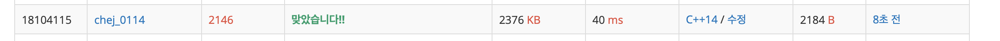

## 문제
- 백준 2146 : 다리 만들기
- DFS
- BFS
- https://www.acmicpc.net/problem/2146

<br/>

## 풀이
- DFS, BFS 모두 사용해야 하는 문제

1. 먼저 DFS 탐색을 사용해 각 섬의 영역을 숫자로 표시한다. 
```
1 1 1 0 0 0 0 1 1 1
1 1 1 1 0 0 0 0 1 1
1 0 1 1 0 0 0 0 1 1
0 0 1 1 1 0 0 0 0 1
0 0 0 1 0 0 0 0 0 1
0 0 0 0 0 0 0 0 0 1
0 0 0 0 0 0 0 0 0 0
0 0 0 0 1 1 0 0 0 0
0 0 0 0 1 1 1 0 0 0
0 0 0 0 0 0 0 0 0 0
```
위 그래프는 DFS 탐색을 마치면 

```
1 1 1 0 0 0 0 2 2 2 
1 1 1 1 0 0 0 0 2 2 
1 0 1 1 0 0 0 0 2 2 
0 0 1 1 1 0 0 0 0 2 
0 0 0 1 0 0 0 0 0 2 
0 0 0 0 0 0 0 0 0 2 
0 0 0 0 0 0 0 0 0 0 
0 0 0 0 3 3 0 0 0 0 
0 0 0 0 3 3 3 0 0 0 
0 0 0 0 0 0 0 0 0 0 
```
위와 같이 영역이 번호로 표시된다.


2. BFS 탐색을 이용하여 각 섬에서 다른 섬으로 가는 최소 거리를 구한 뒤, 이 중 최소를 출력한다.   
주의할 점은 **현재 queue의 size 만큼 for문을 돌린 다음 result를 1 증가** 시키는 것이다.


<br/>

## 코드

```c++
#include <iostream>
#include <queue>
#include <cstring>

#define MAX 101
#define INF 987654321

using namespace std;

const int dy[4] = {-1,1,0,0};
const int dx[4] = {0,0,-1,1};

int n;
int map[MAX][MAX];
bool visited[MAX][MAX] = {false,};
int result;

int min(int a, int b){
    return a < b ? a : b;
}

void dfs(int y, int x, int cnt){
    visited[y][x] = true;
    map[y][x] = cnt;

    for(int i=0; i<4; i++){
        int ny = y + dy[i];
        int nx = x + dx[i];

        if(ny<0 || nx<0 || ny>=n || nx>=n) continue;
        if(!visited[ny][nx] && map[ny][nx]) dfs(ny,nx,cnt);
    }
}

void bfs(int cnt){
    queue <pair<int,int>> que;
    
    for(int i=0; i<n; i++){
        for(int j=0; j<n; j++){
            if(map[i][j] == cnt){
                visited[i][j] = true;
                que.push(make_pair(i,j));
            }
        }
    }
    
    while(!que.empty()){
        int cursize = que.size();
        
        for(int i=0; i<cursize; i++){
            int y = que.front().first;
            int x = que.front().second;
            que.pop();
            
            for(int i=0; i<4; i++){
                int ny = y + dy[i];
                int nx = x + dx[i];
                
                if(ny<0 || nx<0 || ny>=n || nx>=n) continue;
                if(map[ny][nx] && map[ny][nx] != cnt) return;
                else if (!map[ny][nx] && !visited[ny][nx]) {
                    visited[ny][nx] = true;
                    que.push(make_pair(ny, nx));
                }
            }
            
        }
        result++;
    }
}

int main(void){

    cin >> n;
    for(int i=0; i<n; i++){
        for(int j=0; j<n; j++){
            cin >> map[i][j];
        }
    }

    int cnt = 0;
    // dfs 를 통해 섬의 번호 표시
    for(int i=0; i<n; i++){
        for(int j=0; j<n; j++){
            if(map[i][j] && !visited[i][j]) {
                cnt++;
                dfs(i,j,cnt);
            }
        }
    }
    
    int ans = INF;
    
    for(int i=1; i<cnt; i++){
        memset(visited, false, sizeof(visited));
        result = 0;
        bfs(i);
        ans = min(ans, result);
        
    }
    cout << ans << endl;

    return 0;
}

```

<br/>

## screenshot

