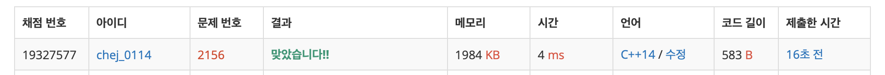

## 문제
- 백준 2156 : 포도주 시식
- DP
- https://www.acmicpc.net/problem/2156

<br/>

## 풀이
- [계단 오르기](https://github.com/ChoiEunji0114/Algorithm-study/blob/master/posts/boj-2579.md) 와 비슷한 문제이다.   

마지막 잔(n번째 잔) 을 마신 경우 크게 두 가지로 나눌 수 있다.

1. `n-1` 잔을 마시지 않을 경우 👉 `n-2` 잔을 마실 수 있다 (연속 두 잔)
2. `n-1` 잔을 마신 경우 👉 `n-2` 잔을 고르면 연속 세 잔이 되므로 (`n-2` , `n-1`, `n` 잔) 마실 수 없다.

그러므로 점화식은 아래와 같다.

```c++
dp[n] = dp[n-1] + arr[n];
dp[n] = dp[n-3] + arr[n-1] + arr[n];
```
그러나 **반례** 가 존재한다. 2번 연속 안 마실 경우가 존재하기 때문이다. 따라서

```c++
dp[n] = max(dp[n-1], dp[n]);
```
도 점화식에 추가해야 한다.


<br/>

## 코드

```c++
#include <iostream>
#define MAX 10001

using namespace std;

int max(int a, int b){
    return a > b ? a : b;
}

int main(void){
    
    int n, arr[MAX], dp[MAX];
    cin >> n;
    for(int i=1; i<=n; i++){
        cin >> arr[i];
    }
    
    dp[1] = arr[1];
    if(n>1) dp[2] = arr[1] + arr[2];
    if(n>2) dp[3] = max(arr[1]+arr[2], arr[2]+arr[3]);
    
    for(int i=3; i<=n; i++){
        dp[i] = max(dp[i-3] + arr[i-1] + arr[i], dp[i-2]+arr[i]);
        dp[i] = max(dp[i-1], dp[i]); // 아얘 마시지 않는 경우
    }
    
    cout << dp[n] << endl;
    
    return 0;
}
```

<br/>

## screenshot

