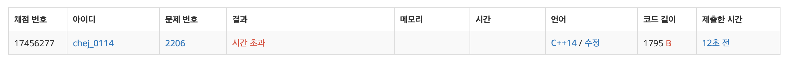
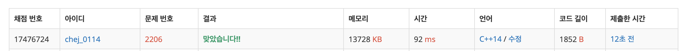

## 문제
- 백준 2206 : 벽 부수고 이동하기
- BFS
- https://www.acmicpc.net/problem/2206

<br/>

## 풀이 1
```c++
#include <iostream>
#include <queue>

using namespace std;

int n, m;
char map[1001][1001] = {0,};
bool visited[1001][1001] = {false,};

const int dy[] = {-1,1,0,0};
const int dx[] = {0,0,-1,1};

int ans = 987654321;

int min(int a, int b){
    return a < b ? a : b;
}

void bfs(){
    queue<pair<int,pair<int,int>>> que;
    que.push(make_pair(1, make_pair(1, 1)));
    
    while(!que.empty()){
        auto now = que.front();
        int cnt = now.first;
        int y = now.second.first;
        int x = now.second.second;
        
        if(y==n && x==m){
            break;
        }
        
        que.pop();
        visited[y][x] = true;
        
        for(int i=0; i<4; i++){
            int ny = y + dy[i];
            int nx = x + dx[i];
            
            if(ny<1 || nx<1 || ny>n || nx>m) continue;
            if(visited[ny][nx]) continue;
            if(map[ny][nx] == '1') continue;
            if(!visited[ny][nx] && map[ny][nx] == '0'){
                que.push(make_pair(cnt+1, make_pair(ny, nx)));
            }
        }
    }
    
    // 초기화
    for(int i=1; i<=n; i++){
        for(int j=1; j<=m; j++){
            visited[i][j] = false;
        }
    }
    
    // cnt update
    auto now = que.front().second;
    if(now.first == n && now.second == m){
        ans = min(ans, que.front().first);
    }
}


int main(void){
    
    cin >> n >> m;
    for(int i=1; i<=n; i++){
        for(int j=1; j<=m; j++){
            cin>> map[i][j];
        }
    }
    
    for(int i=1; i<=n; i++){
        for(int j=1; j<=m; j++){
            if(map[i][j] == '1'){
                map[i][j] = '0';
                bfs();
                map[i][j] = '1';
            }
        }
    }
    
    if(ans==987654321){
        cout << -1 << endl;
    } else {
        cout << ans << endl;
    }
    
    return 0;
}

```

<br/>

- 벽이 있는 경우(```map[i][j] = '1'```) 벽을 부수고(```map[i][j] = '0'```) 그 다음 BFS를 진행했다.
- 즉, 벽을 부수는 모든 경우에 대해 탐색을 한 것이다.



- 답은 제대로 나오나 역시나 시간 초과가 나왔다. 비효율적이기 때문이다 .. 


<br/>

## 풀이 2

```c++
#include <iostream>
#include <string>
#include <queue>
#define MAX 1001

using namespace std;

int n, m;
int graph[MAX][MAX];
int cache[MAX][MAX][2]; // 2 = 벽을 뚫었는지 여부

const int dy[4] = {-1,1,0,0};
const int dx[4] = {0,0,-1,1};

int min(int a, int b){
    return a < b ? a : b;
}

int bfs(){
    
    queue<pair<pair<int,int>, int>> que; // y, x, 벽뚫기
    que.push(make_pair(make_pair(0, 0), 1)); // 시작점, 벽 뚫기 가능 (1=가능, 0=불가능)
    cache[0][0][1] = 1;
    
    while(!que.empty()){
        int y = que.front().first.first;
        int x = que.front().first.second;
        int block = que.front().second;
        que.pop();
        
        if(y==n-1 && x==m-1){ // 도착했을 경우
            return cache[y][x][block];
        }
        
        for(int i=0; i<4; i++){
            int ny = y + dy[i];
            int nx = x + dx[i];
            
            if(ny>=0 && ny<n && nx>=0 && nx<m){
                
                // 벽이 있고 벽을 아직 뚫지 않았을 경우
                if(graph[ny][nx]==1 && block){
                    cache[ny][nx][block-1] = cache[y][x][block] + 1;
                    que.push(make_pair(make_pair(ny, nx), block-1));
                }
                
                // 벽이 없고 방문하지 않았던 곳일 경우
                else if (graph[ny][nx] == 0 && cache[ny][nx][block]==0){
                    cache[ny][nx][block] = cache[y][x][block]+1;
                    que.push(make_pair(make_pair(ny, nx), block));
                }
            }
        }
    }
    return -1;
}

int main(void){
    
    cin >> n >> m;
    
    for(int i=0; i<n; i++){
        string temp;
        cin >> temp;
        for(int j=0; j<m; j++){
            graph[i][j] = temp[j]-'0';
        }
    }
    
    cout << bfs() << endl;
    
    return 0;
}

```

- 탐색은 한 번만 이루어진다.
- 벽을 뚫었는지 여부를 확인하기 위해 cache 배열을 삼중 배열로 선언하였다.   
(마지막 2는 벽을 뚫었는지 여부를 저장)   




성공 ‼️   
벽을 뚫는다는 조건이 생각보다 까다로웠던 문제였다   
