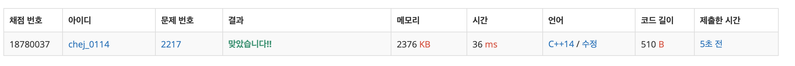

## 문제
- 백준 2217 : 로프
- Greedy
- https://www.acmicpc.net/problem/2217

<br/>

## 풀이
- 핵심은 각 로프에는 동일한 하중이 걸러야 한다는 점이다.   
현재 병렬로 연결되어있는 로프 중에서 가장 적은 수치의 최대 중량이 각 로프에 걸릴 수 있는 최대 중량이다.
- 먼저 로프를 내림차순으로 정렬한 후 각 로프가 가장 적은 수치일 경우의 최대 중량을 차례대로 구한다.

<br/>

## 코드

```c++
#include <iostream>
#include <algorithm> // sort
#include <functional> // greater

#define MAX 100000

using namespace std;

int n, w[MAX];

int max(int a, int b){
    return a > b ? a : b;
}

int main(void){
    
    cin >> n;
    for(int i=0; i<n; i++){
        cin >> w[i];
    }
    
    sort(w, w+n, greater<int>()); // 내림차순 정렬
    
    int ans = 0;
    for(int i=0; i<n; i++){
        int tmp = w[i]*(i+1);
        ans = max(ans, tmp);
    }
    
    cout << ans << endl;
    
    return 0;
}


```

<br/>


## screenshot

