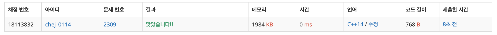

## 문제
- 백준 2309 : 일곱 난쟁이
- 부르트포스
- https://www.acmicpc.net/problem/2309

<br/>

## 풀이
- 처음 풀어보는 부르트포스 문제라 쉬운 문제임에도 갈피를 못 잡았다 ㅠㅠ 
- 관건은 일곱 난쟁이 키의 합을 구하는 게 아니라 **전체 키 합에서 두 명의 난쟁이 키를 빼는 것** 이다.
```c++
sum - height[i] - height[j] == 100 // 전체 합 - 난쟁이1 - 난쟁이2 = 일곱 난쟁이 키의 합 
```

<br/>

## 코드

```c++
#include <iostream>
#include <vector>
#include <algorithm>
using namespace std;

const int MAX = 9;

vector<int> height;
int sum = 0;

void solution(void){
    for(int i=0; i<MAX; i++){
        for(int j=i+1; j<MAX; j++){
            if(sum-height[i]-height[j] == 100){
                // 출력
                for(int k=0; k<MAX; k++){
                    if(k!=i && k!=j){
                        cout << height[k] << endl;
                    }
                }
                return;
            }
        }
    }
}

int main(void){
    
    for(int i=0; i<MAX; i++){
        int tmp;
        cin >> tmp;
        height.push_back(tmp);
        sum += tmp;
    }
    
    sort(height.begin(), height.end()); // 미리 정렬
    solution();
    
    return 0;
}

```

<br/>

## screenshot

