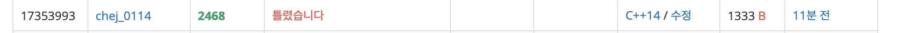

## 문제
- 백준 2468 : 안전 영역
- DFS
- BFS
- https://www.acmicpc.net/problem/2468

<br/>

## 코드

```c++
#include <iostream>

using namespace std;

int map[101][101];
bool visited[101][101] = {false,};

int n;
int cnt=0;
int ans=1;

const int dy[] = {-1,1,0,0};
const int dx[] = {0,0,-1,1};

int max(int a, int b){
    return a>=b ? a : b;
}

void dfs(int y, int x, int num){
    visited[y][x] = true;
    
    for(int i=0; i<4; i++){
        int ny = y + dy[i];
        int nx = x + dx[i];
        
        if(ny<0 || nx<0 || ny>=n || nx>=n) continue;
        if(map[ny][nx] <= num) continue;
        if(!visited[ny][nx] && map[ny][nx]>num) {
            dfs(ny,nx,num);
        }
    }
}

void solution(){
    for(int num=1; num<=10; num++){ // num : 지역이 잠기는 높이
        
        for(int i=0; i<n; i++){
            for(int j=0; j<n; j++){
                if(map[i][j]>num && !visited[i][j]){
                    cnt++;
                    dfs(i,j, num);
                }
            }
        }
        ans = max(ans, cnt);
        
        // 초기화
        cnt = 0;
        for(int i=0; i<n; i++){
            for(int j=0; j<n; j++){
                visited[i][j] = false;
            }
        }
    }
}

int main(void){
    
    cin >> n;
    for(int i=0; i<n; i++){
        for(int j=0; j<n; j++){
            cin >> map[i][j];
        }
    }
    
    solution();
    cout << ans << endl;
    
    return 0;
}


```



너무 쉬운데? 하면서 10분만에 풀었는데 틀렸습니다 가 나왔다 .. 😔

<br/>

- 탐색도 제대로 이루어지고, 답도 제대로 나오는데 왜❓❓
- 코드를 다시 아무리 읽어봐도 오류가 전혀 없었다 ,, 이유를 모르겠어서 찾아봤더니 **예외사항** 을 처리하지 않았다.
- 🌟만일 모든 영역의 높이가 동일하다면🌟 , 안전한 영역의 갯수는 1일 지도 모르나, 탐색 자체가 이루어지지 않아 답이 0이 나온다.
- 따라서 답을 출력하기 전 ans가 0일 경우 1로 값을 바꾸었더니 바로 문제가 해결되었다.
 
<br/>

```c++
#include <iostream>

using namespace std;

int map[101][101];
bool visited[101][101] = {false,};

int n;
int cnt=0, ans=1;
int maxHeight = 0;

const int dy[] = {-1,1,0,0};
const int dx[] = {0,0,-1,1};

int max(int a, int b){
    return a>=b ? a : b;
}

void dfs(int y, int x, int num){
    visited[y][x] = true;
    
    for(int i=0; i<4; i++){
        int ny = y + dy[i];
        int nx = x + dx[i];
        
        if(ny<0 || nx<0 || ny>=n || nx>=n) continue;
        if(map[ny][nx] <= num) continue;
        if(!visited[ny][nx] && map[ny][nx]>num) {
            dfs(ny,nx,num);
        }
    }
}

void solution(){
    for(int num=1; num<=maxHeight; num++){ // num : 지역이 잠기는 높이
        
        for(int i=0; i<n; i++){
            for(int j=0; j<n; j++){
                if(map[i][j]>num && !visited[i][j]){
                    cnt++;
                    dfs(i,j, num);
                }
            }
        }
        ans = max(ans, cnt);
        
        // 초기화
        cnt = 0;
        for(int i=0; i<n; i++){
            for(int j=0; j<n; j++){
                visited[i][j] = false;
            }
        }
    }
}

int main(void){
    
    cin >> n;
    
    for(int i=0; i<n; i++){
        for(int j=0; j<n; j++){
            cin >> map[i][j];
            if(map[i][j] > maxHeight) maxHeight = map[i][j];
        }
    }
    
    solution();
    if(ans==0) ans=1; // 모든 곳의 높이가 동일한 경우 예외 처리
    cout << ans << endl;
    
    return 0;
}

```

<br/>

## screenshot


<br/>

## 반성

예.. 외.. 처.. 리..
