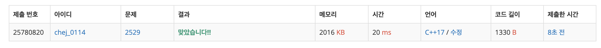

## 문제
- 백준 2529 : 부등호
- https://www.acmicpc.net/problem/2529
- 부르트포스

<br/>

## 풀이
이 문제에서 주목해야 할 부분은 크게 두 가지이다.

1. 부등호 기호 앞뒤에 넣을 수 있는 숫자는 **0부터 9까지** 의 정수이다.
2.  선택된 숫자는 **모두 달라야 한다.**  

최대값은 9,8,7, ... 부터(최대가 9이므로) k+1 개까지 선택한 숫자의 조합으로 완성 되고, 최소값은 0부터 k+1 개까지 선택한 숫자의 조합으로 완성된다. 이 때 숫자의 조합은 C++의 [permutation](https://github.com/choidam/TIL/blob/master/algorithm/pemutation.md) 함수를 사용한다.

<br/>

## 코드
```c++
#include <iostream>
#include <algorithm>
#include <vector>

using namespace std;

// 부등호 검사
bool check(vector<int> &perm, vector<char> &vec){
    for(int i=0; i<vec.size(); i++){
        if(vec[i]=='<' && perm[i] > perm[i+1]) return false;
        if(vec[i]=='>' && perm[i] < perm[i+1]) return false;
    }
    return true;
}

int main(void){
    
    ios::sync_with_stdio(false);
    cin.tie(0); cout.tie(0);
    
    int k;
    cin >> k;
    
    vector<char> vec(k); // 부등호 저장
    for(int i=0; i<k; i++){
        cin >> vec[i];
    }
    
    vector<int> small(k+1); // 가장 작은 수 k+1 개 저장 : 0,1,2, ..
    vector<int> big(k+1); // 가장 큰 수 k+1 개 저장 : 9,8,7, ..
    
    for(int i=0; i<=k; i++){
        small[i] = i;
        big[i] = 9-i;
    }
    
    // 작은 수 순열 구하기
    do{
        if(check(small, vec)) break;
    }while(next_permutation(small.begin(),small.end()));
    
    // 큰 수 순열 구하기
    do{
        if(check(big, vec)) break;
    }while(prev_permutation(big.begin(), big.end()));
    
    // 최대 정수 출력
    for(int i=0; i<big.size(); i++){
        cout << big[i];
    }
    cout << '\n';
    
    // 최소 정수 출력
    for(int i=0; i<small.size(); i++){
        cout << small[i];
    }
    cout << '\n';
    
    return 0;
}

```

<br/>

## screenshot


