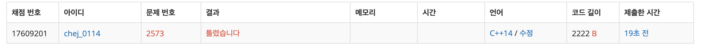
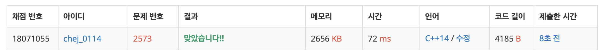

## 문제
- 백준 2373 : 빙산
- BFS
- DFS
- https://www.acmicpc.net/problem/2573

<br/>

## 풀이 1

```c++
#include <iostream>
#define MAX 301

using namespace std;

int n, m;
int year = 0;
int map[MAX][MAX];
int tmp[MAX][MAX];
bool visited[MAX][MAX] = {false,};

const int dy[4] = {-1,1,0,0};
const int dx[4] = {0,0,-1,1};

void dfs(int y, int x){
    visited[y][x] = true;
    
    for(int i=0; i<4; i++){
        int ny = y + dy[i];
        int nx = x + dx[i];
        
        if(ny<0 || nx<0 || ny>=n || nx>=m) continue;
        if(!visited[ny][nx] && map[y][x]>0) dfs(ny,nx);
    }
}

void melt(){
    // map 을 tmp 에 복사
    for(int i=0; i<n; i++){
        for(int j=0; j<m; j++){
            tmp[i][j] = map[i][j];
        }
    }
    
    for(int i=0; i<n; i++){
        for(int j=0; j<m; j++){
            if(tmp[i][j]>0){
                int water = 0;
                
                for(int k=0; k<4; k++){
                    int ny = i + dy[k];
                    int nx = j + dx[k];
                    
                    if(ny<0 || nx<0 || ny>=n || nx>=m) continue;
                    if(map[ny][nx]==0) water++;
                }
                
                if(water && map[i][j]-water>=0) tmp[i][j] -= water;
                else if (water&& map[i][j]-water<0) tmp[i][j] = 0;
            }
        }
    }
    
    // tmp 를 다시 map 에 복사
    for(int i=0; i<n; i++){
        for(int j=0; j<m; j++){
            map[i][j] = tmp[i][j];
        }
    }
}

int countIce(){
    int ice = 0;
    
    for(int i=0; i<m; i++){
        for(int j=0; j<n; j++){
            if(map[i][j]>0 && !visited[i][j]){
                ice++;
                dfs(i,j);
            }
        }
    }
    
    return ice;
}

void init(){
    for(int i=0; i<n; i++){
        for(int j=0; j<m; j++){
            visited[i][j] = false;
        }
    }
}

bool isAllZero(){
    for(int i=0; i<n; i++){
        for(int j=0; j<m; j++){
            if(map[i][j]>0) return false;
        }
    }
    return true;
}

int main(void){
    
    cin >> n >> m;
    for(int i=0; i<n; i++){
        for(int j=0; j<m; j++){
            cin >> map[i][j];
        }
    }
    
    while(true){
        int cntice = countIce();
        init();
        
        if(cntice==0){
            cout << 0 << endl;
            break;
        } else if (cntice>=2){
            cout << year << endl;
            break;
        }

        melt();
        year++;
    }

    return 0;
}


```

<br/>

- 답은 제대로 나오나 에러가 계속 나왔다.
- 아마 year 가 0인 경우 처리하는 과정에서 나온 오류인 것 같지만 제대로 해결하지 못했다 .. 



<br/>

## 풀이 2

```c++
#include <iostream>
#include <queue>
#include <algorithm>
#include <cstring>

#define MAX 300

using namespace std;

int dy[4] = {-1,1,0,0};
int dx[4] = {0,0,-1,1};

int n, m;
int graph[MAX][MAX];
bool visited[MAX][MAX];

void melt(void){
    int copy[MAX][MAX];
    
    for(int y=0; y<n; y++)
        for(int x=0; x<m; x++)
            copy[y][x] = graph[y][x];
    
    for(int y=1; y<n-1; y++){
        for(int x=1; x<m-1; x++){
            if(copy[y][x]){
                int cnt = 0;
                for(int i=0; i<4; i++){
                    int ny = y + dy[i];
                    int nx = x + dx[i];
                    
                    if(copy[ny][nx] == 0) cnt++;
                }
                
                graph[y][x] = max(copy[y][x]-cnt, 0);
                
            }
        }
    }
}

void dfs(int y, int x){
    visited[y][x] = true;
    
    for(int i=0; i<4; i++){
        int ny = y + dy[i];
        int nx = x + dx[i];
        
        if(1<=ny && y<n-1 && 1<=nx && nx<m-1){
            if(graph[ny][nx] && !visited[ny][nx]){
                dfs(ny,nx);
            }
        }
    }
}

int main(void){
    
    ios_base::sync_with_stdio(0);
    cin.tie(0);
    
    cin >> n >> m;
    
    for(int i=0; i<n; i++)
        for(int j=0; j<m; j++)
            cin >> graph[i][j];
    
    int year = 0;
    while(1){
        memset(visited, false, sizeof(visited));
        
        bool result = false;
        int cnt = 0;
        
        
        for(int y=1; y<n-1; y++){
            for(int x=1; x<m-1; x++){
                if(graph[y][x] && visited[y][x] == false){
                    cnt++;
                    if(cnt==2){
                        result = true;
                        break;
                    }
                    dfs(y,x);
                }
            }
        }
        
        if(result) break;
        if(cnt==0){
            year = 0;
            break;
        }
        
        melt();
        year++;
        
    }
    
    cout << year << endl;
    
    return 0;
}


```




- 성공 ‼️   
- 마지막 에러 처리까지 완벽히 처리하도록 유의하자 ..!


<br/>


## new

```c++
    ios_base::sync_with_stdio(0);
    cin.tie(0);
```

- cin 의 성능을 높여주는 매우 유용한 코드!! 기억해두자

