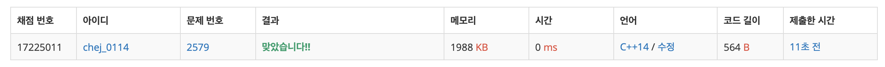

## 문제
- 백준 2579 : 계단 오르기
- DP
- https://www.acmicpc.net/problem/2579

<br/>

## 풀이
- ```stiar``` 에는 계단 점수를,  ```dp``` 에는 점수의 최댓값을 저장했다.
- 조건을 잘 기억해두자. <br/>
> 1. 계단은 한 번에 한 계단씩 또는 두 계단씩 오를 수 있다. 
> 2. 연속된 세 개의 계단을 모두 밟아서는 안 된다. 단, 시작점은 계단에 포함되지 않는다.
> 3. 마지막 도착 계단은 반드시 밟아야 한다.

<br/> 

문제의 조건 **마지막 계단을 무조건 밟아야 한다** 을 따르면, 두 가지로 분류할 수 있다.
1. 전 칸 (```n-1```)을 밟고 마지막 칸(```n```)을 밟는 경우

|n-3|n-2|n-1|n|
|---|---|---|--|
|❓|❓|⭕️|⭕️|

위 경우 연속으로 3칸을 밟을 수 없으므로 ```n-2``` 번 째 칸을 밟을 수 없다. 

|n-4|n-3|n-2|n-1|n|
|---|---|---|--|--|
|❓|⭕️|❌|⭕️|⭕️|

```n-3 + n-1 + n``` 으로 쓸 수 있다. 즉 전전전전까지의 최댓값 + 전칸 값 + 현재칸 값 이다. <br/>
```dp[n] = dp[n-3] + stair[n-1] + stair[n]``` 으로 정리할 수 있다.


<br/>

2. 전전 칸(```n-2```)을 밟고 마지막 칸(```n```)을 밟는 경우

|n-3|n-2|n-1|n|
|---|---|---|--|
|❓|⭕️|❌|⭕️|

```n-2 + n``` 으로 쓸 수 있다. 즉 전전전까지의 최대값 + 현재칸 값 이다. <br/>
```dp[n] = dp[n-2] + stair[n] ``` 으로 정리할 수 있다. 

<br/>

## 코드

```c++
#include <iostream>
#include <queue>

using namespace std;

int stair[301]; // 계단 점수
int dp[301]; // 점수의 최댓값

int max(int a, int b){
    return a > b ? a : b;
}

int main(void){
    
    int n;
    cin >> n;
    for(int i=0; i<n; i++){
        cin >> stair[i];
    }
    
    dp[0] = stair[0];
    dp[1] = stair[0] + stair[1];
    dp[2] = max(stair[0]+stair[2], stair[1]+stair[2]);
    
    for(int i=3; i<n; i++){
        dp[i] = max(dp[i-3]+stair[i-1]+stair[i], dp[i-2]+stair[i]);
    }
    
    cout << dp[n-1] << endl;
    
    return 0;
}

```
<br/>


## screenshot


<br/>

## 반성
- DP 점화식 구하기는 ,, 세상 어렵다 ,, 🤯 많이 풀어보자 ‼️🔥

