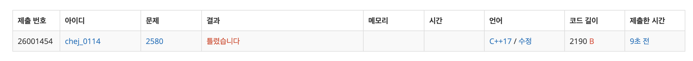

## 문제

- 백준 2580 : 스도쿠
- 부르트포스
- 백트래킹
- https://www.acmicpc.net/problem/2580

<br/>

## 풀이1
```c++
#include <iostream>

using namespace std;

int sudoku[10][10];

bool check_row[10][10]; // 행 검사 : x행에 숫자 y가 있으면 true
bool check_col[10][10]; // 열 검사 : x열에 숫자 y가 있으면 true
bool check_square[10][10]; // 작은 정사각형 검사 : x번째 작은 정사각형에 숫자 y가 있으면 true

// row행 col열이 속하는 작은 정사각형 구하기
int get_square(int row, int col){
    return (row/3)*3 + (col/3);
}

// sudoku 출력
void print(){
    for(int i=0; i<9; i++){
        for(int j=0; j<9; j++){
            cout << sudoku[i][j] << ' ';
        }
        cout << '\n';
    }
}

// num번째 스도쿠 구하기
void solve(int num){
    // 마지막 칸인 경우 -> 출력 후 종료
    if(num == 81) {
        print();
        return;
    }
    
    // 행, 열 구하기
    int x = num/9; int y = num%9;
    
    if(sudoku[x][y] != 0){
        // 수가 있으면 -> 다음 수로 넘어가기
        solve(num+1);
    } else {
        // 수가 없으면 -> 1~9 검사해서 수 채우기
        for(int i=1; i<=9; i++){
            if(!check_row[x][i] && !check_col[y][i] && !check_square[get_square(x, y)][i]){
                // 스도쿠 처리
                check_row[x][i] = true;
                check_col[y][i] = true;
                check_square[get_square(x, y)][i] = true;
                sudoku[x][y] = i;
                
                solve(num+1);
                
                // 다시 돌려놓기 (백트래킹)
                check_row[x][i] = false;
                check_col[y][i] = false;
                check_square[get_square(x, y)][i] = false;
                sudoku[x][y] = 0;
            }
        }
    }
}

int main(void){
    
    for(int i=0; i<9; i++){
        for(int j=0; j<9; j++){
            cin >> sudoku[i][j];
            
            // 빈칸이 아닌 경우 처리
            if(sudoku[i][j] != 0){
                check_row[i][sudoku[i][j]] = true;
                check_col[j][sudoku[i][j]] = true;
                check_square[get_square(i, j)][sudoku[i][j]] = true;
            }
        }
    }
    
    // 0번 칸부터 채우기 시작
    solve(0);
    
    return 0;
}

```



스도쿠 빈 칸에 알맞은 숫자를 넣으려면 세 가지 조건을 충족해야 한다.

1. 빈 칸의 행에 겹치는 숫자가 존재하면 안 된다.
2. 빈 칸의 열에 겹치는 숫자가 존재하면 안 된다.
3. 빈 칸의 작은 정사각형 내에 겹치는 숫자가 존재하면 안 된다.

각각 배열 `check_row`, `check_col`, `check_square` 로 검사했다. 그러나 제출하니 오류가 나왔다 ㅠㅠ (사실 아직 정확한 이유는 모르겠다.)

<br/>

## 풀이 2

```c++
#include <iostream>

using namespace std;

int sudoku[10][10];

bool check_row[10][10]; // 행 검사 : x행에 숫자 y가 있으면 true
bool check_col[10][10]; // 열 검사 : x열에 숫자 y가 있으면 true
bool check_square[10][10]; // 작은 정사각형 검사 : x번째 작은 정사각형에 숫자 y가 있으면 true

// row행 col열이 속하는 작은 정사각형 구하기
int get_square(int row, int col){
    return (row/3)*3 + (col/3);
}

// sudoku 출력
void print(){
    for(int i=0; i<9; i++){
        for(int j=0; j<9; j++){
            cout << sudoku[i][j] << ' ';
        }
        cout << '\n';
    }
}

// num번째 스도쿠 구하기
bool solve(int num){
    // 마지막 칸인 경우 -> 출력 후 종료
    if(num == 81) {
        print();
        return true;
    }
    
    // 행, 열 구하기
    int x = num/9; int y = num%9;
    
    if(sudoku[x][y] != 0){
        // 수가 있으면 -> 다음 수로 넘어가기
        return solve(num+1);
    } else {
        // 수가 없으면 -> 1~9 검사해서 수 채우기
        for(int i=1; i<=9; i++){
            if(!check_row[x][i] && !check_col[y][i] && !check_square[get_square(x, y)][i]){
                // 스도쿠 처리
                check_row[x][i] = true;
                check_col[y][i] = true;
                check_square[get_square(x, y)][i] = true;
                sudoku[x][y] = i;
                
                if(solve(num+1)){
                    return true;
                }
                
                // 다시 돌려놓기 (백트래킹)
                check_row[x][i] = false;
                check_col[y][i] = false;
                check_square[get_square(x, y)][i] = false;
                sudoku[x][y] = 0;
            }
        }
    }
    
    return false;
}

int main(void){
    
    for(int i=0; i<9; i++){
        for(int j=0; j<9; j++){
            cin >> sudoku[i][j];
            
            // 빈칸이 아닌 경우 처리
            if(sudoku[i][j] != 0){
                check_row[i][sudoku[i][j]] = true;
                check_col[j][sudoku[i][j]] = true;
                check_square[get_square(i, j)][sudoku[i][j]] = true;
            }
        }
    }
    
    // 0번 칸부터 채우기 시작
    solve(0);
    return 0;
}

```

0번째 칸부터 탐색을 시작하는 `solve` 함수에 리턴값을 부여했다. 마지막 칸인 경우 (모든 빈칸을 다 채웠을 경우) 프린트 하도록 했다. 다음 칸을 탐색할 때는 앞선 풀이와는 다르게 리턴값이 true 일 경우에만 재귀함수를 호출하도록 했다.

결과는 성공!! 

