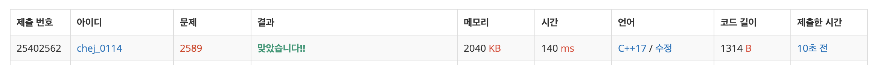

## 문제
- 백준 2589 : 보물섬
- BFS
- 완전탐색
- https://www.acmicpc.net/problem/2589

<br/>

## 풀이
- 완전탐색으로 풀어야 하는 문제. 각 육지마다 탐색을 진행해야 한다.
- 최단 경로를 저장하는 배열 `sum` 을 적절히 업데이트 하는 것이 핵심이다.

```c++
sum[ny][nx] = sum[y][x] + 1; // 누적 경로 저장
```


<br/>

## 코드

```c++
#include <iostream>
#include <queue>
#include <cstring> // memset
#define MAX 51

using namespace std;

int R, C;
int ans = 0;
int arr[MAX][MAX];
int sum[MAX][MAX]; // 최단 경로 저장
bool visited[MAX][MAX];

const int dy[4] = {-1,1,0,0};
const int dx[4] = {0,0,-1,1};

int max(int a, int b){
    return a > b ? a : b;
}

// 최단 경로 구하기
void bfs(int startY, int startX){
    visited[startY][startX] = true;
    queue<pair<int,int>> que;
    que.push(make_pair(startY, startX));
    
    while(!que.empty()){
        int y = que.front().first;
        int x = que.front().second;
        que.pop();
        
        for(int i=0; i<4; i++){
            int ny = y + dy[i];
            int nx = x + dx[i];
            
            if(ny<0 || nx<0 || ny>=R || nx>=C) continue;
            if(arr[ny][nx]==1 && !visited[ny][nx]){
                visited[ny][nx] = true;
                que.push(make_pair(ny, nx));
                sum[ny][nx] = sum[y][x] + 1; // 누적 경로 저장
                ans = max(ans, sum[ny][nx]);
            }
        }
    }
}

int main(void) {
    ios::sync_with_stdio(false);
    cin.tie(0); cout.tie(0);
    
    cin >> R >> C;
    char tmp;
    for(int i=0; i<R; i++){
        for(int j=0; j<C; j++){
            cin >> tmp;
            if(tmp=='L') arr[i][j]=1;
        }
    }
    
    for(int i=0; i<R; i++){
        for(int j=0; j<C; j++){
            if(arr[i][j]==1){
                bfs(i,j);
                memset(visited, false, sizeof(visited));
                memset(sum, 0, sizeof(sum));
            }
        }
    }
    
    cout << ans << '\n';
    
    return 0;
}

```

<br/>


## screenshot

