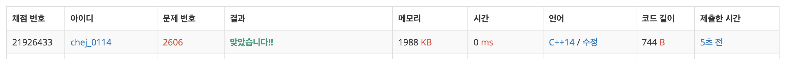

## 문제
- 백준 2606 : 바이러스
- 그래프
- DFS
- BFS
- https://www.acmicpc.net/problem/2606

<br/>

## 풀이
- 간단한 그래프 알고리즘이다.      
  [연결 요소의 개수](https://www.acmicpc.net/problem/11724) 와 매우 비슷한 문제다. 풀이는 [여기](https://github.com/ChoiEunji0114/Algorithm-study/blob/master/posts/boj-11724.md)

- `vector<int> graph[MAX]` 에 간선을 저장하며 DFS 탐색을 하면 바로 풀린다. 이 때 **무방향 그래프** 이므로 

```c++
	graph[node1].push_back(node2);
        graph[node2].push_back(node1);
```

위와 같이 양 방향 모두 간선 배열에 저장해야 한다.

<br/>

## 코드

```c++
#include <iostream>
#include <vector>
#define MAX 100+1

using namespace std;

int n, m;
vector<int> graph[MAX];
bool visited[MAX];
int cnt;

void dfs(int node){
    cnt++;
    visited[node] = true;
    
    for(int i=0; i<graph[node].size(); i++){
        int next = graph[node][i];
        
        if(!visited[next]){
            dfs(next);
        }
    }
    
}

int main(void){
    
    cin >> n >> m;
    
    for(int i=0; i<m; i++){
        int node1, node2;
        cin >> node1 >> node2;
        
        // 무방향 그래프 -> 양 방향 모두 저장
        graph[node1].push_back(node2);
        graph[node2].push_back(node1);
    }
    
    dfs(1); // 1번 노드부터 탐색

    cout << cnt-1 << endl;
    
    return 0;
}
```
<br/>


## screenshot



