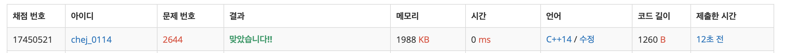

## 문제
- 백준 2644 : 촌수 계산
- BFS
- https://www.acmicpc.net/problem/2644

<br/>

## 풀이
- 무방향 그래프 BFS 문제 이다.
- 예외 처리 잊지 말자..❗️ 촌수를 계산할 수 없을 때엔 잊지 말고 -1 을 출력하자 

<br/>

## 코드

```c++
#include <iostream>
#include <vector>
#include <queue>

using namespace std;

int n, startnode, endnode, m;
vector<int> graph[101];
bool visited[101] = {false,};

queue<pair<int,int>> que;

int main(void){
    
    cin >> n;
    cin >> startnode >> endnode;
    cin >> m;
    for(int i=0; i<m; i++){
        int node1, node2;
        cin >> node1 >> node2;
        graph[node1].push_back(node2);
        graph[node2].push_back(node1);
    }
    
    que.push(make_pair(startnode, 0));
    
    while(!que.empty()){
        auto now = que.front();
        int node = now.first;
        int cnt = now.second;
        
        if(node == endnode){
            break;
        }
        
        que.pop();
        visited[node] = true;
        
        for(int i=0; i<graph[node].size(); i++){
            int next = graph[node][i];
            
            if(!visited[next]){
                que.push(make_pair(next, cnt+1));
            }
        }
    }
    
    if(que.front().first == endnode){
        cout << que.front().second << endl;
    } else {
        cout << -1 << endl;
    }
    
    
    return 0;
}

```

<br/>


## screenshot


<br/>
