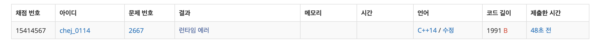
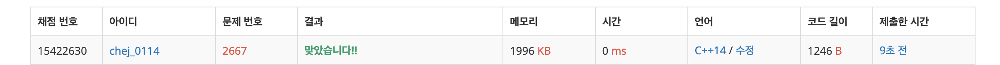

## 문제
- 백준 2667번 - 단지 번호 붙이기
- https://www.acmicpc.net/problem/2667
- BFS / DFS


<br/>


## 풀이
- 처음에 BFS 문제로 접근했으나 런타임 에러가 나왔다

```c
//  2667.cpp
//  baekjoon
//
//  Created by 최은지 on 24/09/2019.
//  Copyright © 2019 최은지. All rights reserved.
//

#include <stdio.h>
#include <iostream>
#include <queue>
#include <algorithm>

using namespace std;

int n;

int map[25][25];
int ans[25][25];

const int dx[] = {0,0,-1,1};
const int dy[] = {-1,1,0,0};

queue <pair<int,int>> que;
int cntArr[25];

void bfs(){
    int k = 0;
    int cur_y, cur_x, ny, nx, cnt;
    
    for(int i=0; i<n; i++){
        for(int j=0; j<n; j++){
            
            if(map[i][j]==1 && ans[i][j]==0){
                k++;
                cur_y = i;
                cur_x = j;
                que.push(make_pair(cur_y, cur_x));
                ans[cur_y][cur_x] = k;
                cnt = 1;
                
                while(!que.empty()){
                    cur_y = que.front().first;
                    cur_x = que.front().second;
                    que.pop();
                    
                    for(int i=0; i<4; i++){
                        ny = cur_y + dy[i];
                        nx = cur_x + dx[i];
                        
                        if(ny<0 || nx<0 || ny>=n || nx>=n)
                            continue;
                        
                        if(map[ny][nx]==0)
                            continue;
                        
                        if(map[ny][nx]==1 && ans[ny][nx]==0){
                            ans[ny][nx] = k;
                            que.push(make_pair(ny, nx));
                            cnt++;
                        }
                    }
                }
            }
        }
    }
    cout << "k : " << k << "\n\n";
}


int main(void){
    
    cin>>n;
    
    for(int i=0; i<n; i++){
        for(int j=0; j<n; j++){
            scanf("%1d", &map[i][j]);
        }
    }
    
    bfs();
    cout << "\n";
    
    for(int i=0; i<n; i++){
        for(int j=0; j<n; j++){
            cout << ans[i][j] << " ";
        }
        cout << "\n";
    }
    
    
    return 0;
}
```



- 메모리를 많이 잡아먹는 것 같아 런타임 에러가 나는 것 같다.
- 방향을 바꾸어 DFS 로 풀어보았다.


<br/>


```c
//
//  2667.cpp
//  baekjoon
//
//  Created by 최은지 on 24/09/2019.
//  Copyright © 2019 최은지. All rights reserved.
//

#include <iostream>
#include <algorithm>
#include <vector>
using namespace std;

bool check[30][30];
int n, map[30][30], arr[1010], cnt; // cnt - 단지 수

int dx[] = {-1,1,0,0};
int dy[] = {0,0,-1,1};

void dfs(int y, int x){
    check[y][x] = true; // 방문표시
    arr[cnt]++; // 단지에 속하는 집의 수
    
    for(int i=0; i<4; i++){
        int ny = y + dy[i];
        int nx = x + dx[i];
        
        if(nx>=0 && ny>=0 && nx<=n && ny<=n){
            if(!check[ny][nx] && map[ny][nx]){
                dfs(ny,nx);
            }
        }
    }
}

int main(void){
    
    cin >> n;
    for(int i=0; i<n; i++){
        for(int j=0; j<n; j++){
            scanf("%1d", &map[i][j]);
        }
    }
    
    for(int i=0; i<n; i++){
        for(int j=0; j<n; j++){
            // 방문하지 않고, 집이 있는 경우 DFS 진행
            if(!check[i][j] && map[i][j]){
                dfs(i,j);
                cnt++;
            }
        }
    }
    
    printf("%d\n", cnt);
    
    sort(arr, arr+cnt);
    for(int i=0; i<cnt; i++)
        printf("%d\n", arr[i]);
    
    return 0;
}

```

 
 
 - 결과 성공!!
 - 아직 탐색하지 않은 단지에 대해 각각 DFS 를 진행했다.
 
 
 
 <br/>
 
 
 
 
 ## 반성
 - BFS 가 익숙해 뭐든지 queue 에 넣고 푸는 경향이 있는데 조심해야겠다 .. 
 
 
 ## 참고자료
 https://sejinik.tistory.com/59
