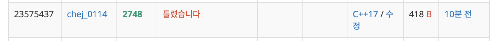
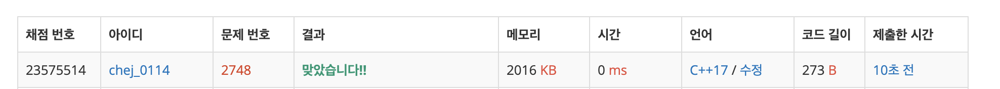

## 문제
- 백준 748 : 피보나치 수2
- DP
- https://www.acmicpc.net/problem/2748

<br/>

## 풀이 1
- 간단한 재귀 함수 호출 문제라고 생각하고 풀었다.
```c++
#include <iostream>

using namespace std;

int fib(int n){
    if(n==0) {
        return 0;
    } else if (n==1){
        return 1;
    } else {
        return fib(n-1) + fib(n-2);
    }
}

int main(void){
    
    int n;
    cin >> n;
    cout << fib(n) << endl;
    
    return 0;
}
```


- 재귀 호출은 메모리 낭비가 심해 시간 초과 에러가 뜬다. 다른 방법을 찾아야 한다!

<br/>

## 풀이 2

```c++
#include <iostream>
#define MAX 91

using namespace std;

int n;
int arr[MAX];

int main(void){
    
    arr[0] = 0; arr[1] = 1;
    for(int i=2; i<=MAX; i++){
        arr[i] = arr[i-1] + arr[i-2];
    }
    
    cin >> n;
    cout << arr[n] << endl;
    
    return 0;
}

```



- 정수 `n` 의 값이 90 이하로 제한되어 있으므로, 재귀 호출 함수를 삭제하고 DP의 정석대로(?) 전체 배열값을 구하기로 했다. 그러나 시간초과에서 틀린 값으로 나왔다.
- 혹시나 해서 값을 찍어보니 적은 수에서는 값이 제대로 나오지만, 최대값과 가까운 88, 89, 90 에서는 피보나치 수가 제대로 출력되지 않았다.
- 곰곰이 생각해보니 피본나치 수가 너무 커서 int의 값을 벗어난 것이었다. 그래서 배열값을 `int` 에서 `long long` 으로 수정했다.

<br/>

## 풀이 3

```c++
#include <iostream>
#define MAX 91

using namespace std;

int n;
long long arr[MAX];

int main(void){
    
    arr[0] = 0; arr[1] = 1;
    for(int i=2; i<MAX; i++){
        arr[i] = arr[i-1] + arr[i-2];
    }

    cin >> n;
    cout << arr[n] << endl;
    
    return 0;
}
```



- 드디어 성공! 코드 자체는 굉장히 짧은 간단한 문제였지만 이것 저것 고려해야 할 요소가 많았다.