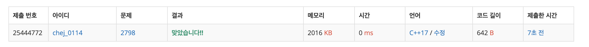

## 문제
- 백준 2798 : 블랙잭
- https://www.acmicpc.net/problem/2798
- 부르트포스

<br/>

## 풀이
- 가장 기본적인 부르트포스 알고리즘 문제. 
- 3개의 카드를 뽑으므로 3중 for문을 돌아 모든 경우의 수를 탐색했다.


<br/>

## 코드
```c++
#include <iostream>
#define MAX 101

using namespace std;

int n, m, ans;
int arr[MAX];

int max(int a, int b){
    return a > b ? a : b;
}

int main(void){
    
    ios::sync_with_stdio(false);
    cin.tie(0); cout.tie(0);
    
    cin >> n >> m;
    for(int i=0; i<n; i++){
        cin >> arr[i];
    }
    
    for(int i=0; i<n; i++){
        for(int j=i+1; j<n; j++){
            for(int k=j+1; k<n; k++){
                int tmpsum = arr[i] + arr[j] + arr[k];
                if(tmpsum <= m) {
                    ans = max(ans, tmpsum);
                }
            }
        }
    }
    
    cout << ans << '\n';
    
    return 0;
}

```

<br/>

## screenshot


