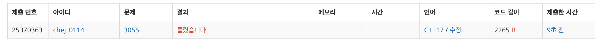
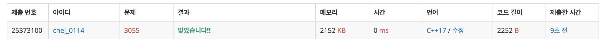

## 문제
- 백준 3055 : 탈출
- https://www.acmicpc.net/problem/3055
- 그래프
- BFS

<br/>

## 풀이 1
```c++
#include <iostream>
#include <queue>
#define MAX 51

using namespace std;

int R, C;
char map[MAX][MAX];
bool visited[MAX][MAX];
bool isArrived;

const int dy[4] = {-1,1,0,0};
const int dx[4] = {0,0,-1,1};

queue<pair<int, pair<int,int>>> que;

void bfs(){
    while(!que.empty()){
        int time = que.front().first;
        auto pos = que.front().second;
        int curY = pos.first;
        int curX = pos.second;
        que.pop();
        
        // 도착한 경우
        if(map[curY][curX] == 'D'){
            cout << time << endl;
            isArrived = true;
            break;
        }
        
        // 물이 찰 예정
        for(int i=0; i<R; i++){
            for(int j=0; j<C; j++){
                if(map[i][j]=='*'){
                    for(int k=0; k<4; k++){
                        int ny = i + dy[k];
                        int nx = j + dx[k];
                        if(ny<0 || nx<0 || ny>=R || nx>=C) continue;
                        if(map[ny][nx]=='.'){
                            map[ny][nx] = '#';
                        }
                    }
                }
            }
        }
        
        // 고슴도치 이동
        for(int i=0; i<4; i++){
            int ny = curY + dy[i];
            int nx = curX + dx[i];
            if(ny<0 || nx<0 || ny>=R || nx>=C) continue;
            if(!visited[ny][nx] && map[ny][nx]!='*' && map[ny][nx]!='#' && map[ny][nx]!='X'){
                visited[ny][nx] = true;
                map[curY][curX] = '.';
                que.push(make_pair(time+1, make_pair(ny, nx)));
            }
        }
        
        // 물이 참
        for(int i=0; i<R; i++){
            for(int j=0; j<C; j++){
                if(map[i][j]=='#') map[i][j]='*';
            }
        }
    }
}


int main(void){
    
    ios_base::sync_with_stdio(false);
    cout.tie(NULL);
    cin.tie(NULL);
    
    cin >> R >> C;
    for(int i=0; i<R; i++){
        for(int j=0; j<C; j++){
            cin >> map[i][j];
        }
    }

    for(int i=0; i<R; i++){
        for(int j=0; j<C; j++){
            if(map[i][j] == 'S'){
                que.push(make_pair(0, make_pair(i, j)));
                visited[i][j] = true;
            }
        }
    }
    
    bfs();
    if(!isArrived) cout << "KAKTUS\n";
    
    return 0;
}

```



테스트 케이스에서는 문제가 없었으나 문제 제출하니 틀렸다고 나왔다.

물 범람하는 경우를 `map` 전체를 순회해 처리했고, 물범람예정 - 물범람을 나누어 처리하는 비효율적인 코드였다. 그러나 고슴도치 이동과 물 범람을 동시해 처리하는 방법이 정말 생각나지 않았다 .. ㅠ ㅠ

<br/>

## 풀이2

```c++
#include <iostream>
#include <queue>
#define MAX 51

using namespace std;

int R, C;
char map[MAX][MAX];
bool visited[MAX][MAX];
int end_y, end_x;

queue<pair<int,int>> water;
queue<pair<int,int>> que;

const int dy[4] = {-1,1,0,0};
const int dx[4] = {0,0,-1,1};

int bfs(){
    int cnt = 0;
    while(!que.empty()){
        cnt++;
        int water_size = water.size();
        
        // 물 범람
        while (water_size--) {
            int y = water.front().first;
            int x = water.front().second;
            water.pop();
            
            for(int i=0; i<4; i++){
                int ny = y + dy[i];
                int nx = x + dx[i];
                
                if(ny<0 || nx<0 || ny>=R || nx>=C) continue;
                if(map[ny][nx] == 'X' || map[ny][nx]=='D' || map[ny][nx]=='*') continue;
                
                water.push(make_pair(ny, nx));
                map[ny][nx] = '*';
            }
        }
        
        // 고슴도치 이동
        int que_size = que.size();
        while(que_size--){
            int y = que.front().first;
            int x = que.front().second;
            que.pop();
            visited[y][x] = true;
            
            // 도착한 경우
            if(y==end_y && x==end_x) {
                cout << cnt-1 << endl;
                return 0; // 종료
            }
            
            for(int i=0; i<4; i++){
                int ny = y + dy[i];
                int nx = x + dx[i];
                
                if(ny<0 || nx<0 || ny>=R || nx>=C) continue;
                if(map[ny][nx]=='X' || map[ny][nx]=='*' || visited[ny][nx]) continue;
                
                visited[ny][nx] = true;
                que.push(make_pair(ny, nx));
            }
        }
    }
    
    cout << "KAKTUS" << endl; // 도착하지 못 한 경우
    return 0;
}


int main(void){
    ios::sync_with_stdio(false);
    cin.tie(0); cout.tie(0);
    
    cin >> R >> C;
    for(int i=0; i<R; i++){
        for(int j=0; j<C; j++){
            cin >> map[i][j];
            if(map[i][j]=='S') que.push(make_pair(i, j));
            if(map[i][j]=='D') { end_y = i; end_x = j;}
            if(map[i][j]=='*') water.push(make_pair(i, j));
        }
    }
    
    bfs();
    
    return 0;
}

```


1. 두 개의 `queue` 사용

```c++
queue<pair<int,int>> water; // 물 범람
queue<pair<int,int>> que; // 고슴도치 이동
```

```c++
   for(int i=0; i<R; i++){
        for(int j=0; j<C; j++){
            cin >> map[i][j];
            if(map[i][j]=='S') que.push(make_pair(i, j));
            if(map[i][j]=='D') { end_y = i; end_x = j;}
            if(map[i][j]=='*') water.push(make_pair(i, j));
        }
    }
```

물 범람을 `water`, 고슴도치 이동을 `que` 를 사용해 처리했다. 입력과 동시에 queue 에 push 했다.


2. bfs 탐색

```c++
     while(!que.empty()){
        // 물 범람
        int water_size = water.size();
        while (water_size--) {
            // 물 범람 처리
        }
        
        // 고슴도치 이동
        int que_size = que.size();
        while(que_size--){
            // 고슴도치 이동 처리
        }
    }
    cout << "KAKTUS" << endl; // 도착하지 못하는 경우
```

탐색은 각각 queue 의 크기 만큼 while문을 도는 것으로 처리했다. 상위 while문 - 물 범람 while, 고슴도치 이동 while 의 형태로 이루어져 있다. 


