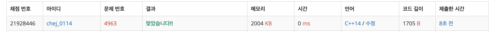

## 문제
- 백준 4963 : 섬의 개수
- 그래프
- DFS
- BFS
- https://www.acmicpc.net/problem/2468

<br/>

## 풀이

- 간단한 DFS 문제이다. 
- 처음에 오류가 많이 났는데,, 문제를 제대로 안 읽어서 였다 ㅠㅠ 상하좌우가 아니라 대각선으로 이동 가능이므로 갈 수 있는 방향이 총 8가지이다.

<br/>

## 코드

```c++
#include <iostream>
using namespace std;

int place[51][51];  // 0 : 바다, 1 : 섬
int check[51][51];  // 0 : 방문안함, 1이상 : 섬의 번호
int dx[8] = {0, -1, -1, -1, 0, 1, 1, 1};
int dy[8] = {-1, -1, 0, 1, 1, 1, 0, -1};
int w, h;

//인접한 모든 섬을 탐색하고, 번호를 부여함
void dfs(int i, int j, int num){
    check[i][j] = num;

    // 8개의 방향중에 갈 수 있는 경우, 그리고 방문하지 않은 경우에만 탐색
    for(int k = 0; k < 8; k++){
        int x = i + dx[k];
        int y = j + dy[k];
        
        if(x>=1 && x<=h && y>=1 && y <= w){
            if (place[x][y] == 1 && check[x][y] == 0){
                dfs(x, y, num);
            }
        }
    }
}

int main()
{
    ios::sync_with_stdio(false);
    cin.tie(NULL);
    cout.tie(NULL);

    while(true)
    {
        //가로세로 입력받기
        cin >> w >> h;
        if (w == 0 && h == 0)
            break;

        //배열 사용전 초기화
        for (int i = 1; i <= h; i++){
            for (int j = 1; j <= w; j++){
                place[i][j] = 0;
                check[i][j] = 0;
            }
        }

        //땅, 바다 정보 입력받기
        for (int i = 1; i <= h; i++){
            for (int j = 1; j <= w; j++){
                cin >> place[i][j];
            }
        }

        //모든 점을 시작점으로 하여 탐색 진행, 연결된 섬인 경우에 같은 번호 부여
        int num = 0;
        for (int i = 1; i <= h; i++){
            for (int j = 1; j <= w; j++){
                if (place[i][j] == 1 && check[i][j] == 0)
                    dfs(i, j, ++num);
            }
        }
        
        cout << num << "\n";
    }
}

```

## Screenshot



