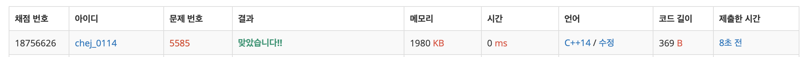

## 문제
- 백준 5585 : 거스름돈
- https://www.acmicpc.net/problem/5585
- Greedy

<br/>

## 풀이
- 정말 간단한 그리디 알고리즘 문제
- [백준 동전0](https://www.acmicpc.net/problem/11047) 과 거의 동일한 문제다. 큰 가치의 동전부터 탐색한다.   
👆 풀이는 [여기](https://github.com/ChoiEunji0114/Algorithm-study/blob/master/posts/boj-11047.md)

<br/>

## 코드

```c++
#include <iostream>

using namespace std;

int main(void){
    
    int coin[6] = {500,100,50,10,5,1};
    int money;
   
    cin >> money;
    
    int lift = 1000 - money;
    int cnt = 0;
    
    for(int i=0; i<6; i++){
        while(lift>=coin[i]){
            lift -= coin[i];
            cnt++;
        }
    }
    
    cout << cnt << endl;
    
    return 0;
}

```

<br/>

## screenshot


